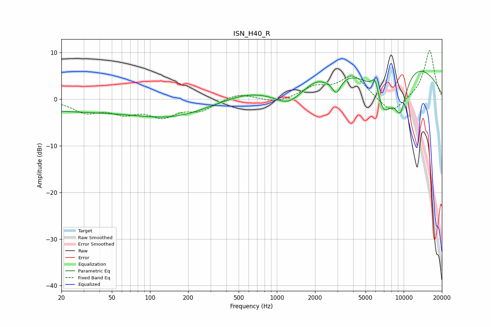

# ISN_H40_R
See [usage instructions](https://github.com/jaakkopasanen/AutoEq#usage) for more options and info.

### Parametric EQs
Apply preamp of -6.1 dB when using parametric equalizer.

|   # | Type    |   Fc (Hz) |    Q |   Gain (dB) |
|-----|---------|-----------|------|-------------|
|   1 | Peaking |        35 | 0.18 |        -2.6 |
|   2 | Peaking |       162 | 0.56 |        -2.2 |
|   3 | Peaking |       582 | 0.8  |         1.4 |
|   4 | Peaking |      1227 | 1.49 |        -2.8 |
|   5 | Peaking |      1990 | 2.24 |         0.9 |
|   6 | Peaking |      2941 | 4.09 |        -3.4 |
|   7 | Peaking |      5959 | 4.59 |         4.2 |
|   8 | Peaking |      6883 | 1.44 |       -11.3 |
|   9 | Peaking |      8086 | 0.28 |        10   |
|  10 | Peaking |      9435 | 2.49 |        -8   |

### Fixed Band EQs
When using fixed band (also called graphic) equalizer, apply preamp of **-10.5 dB** (if available) and set gains manually with these parameters.

|   # | Type    |   Fc (Hz) |    Q |   Gain (dB) |
|-----|---------|-----------|------|-------------|
|   1 | Peaking |        31 | 1.41 |        -2.6 |
|   2 | Peaking |        62 | 1.41 |        -2.5 |
|   3 | Peaking |       125 | 1.41 |        -3.3 |
|   4 | Peaking |       250 | 1.41 |        -2.2 |
|   5 | Peaking |       500 | 1.41 |         1.4 |
|   6 | Peaking |      1000 | 1.41 |        -0.9 |
|   7 | Peaking |      2000 | 1.41 |         2.3 |
|   8 | Peaking |      4000 | 1.41 |         5   |
|   9 | Peaking |      8000 | 1.41 |        -3.5 |
|  10 | Peaking |     16000 | 1.41 |        10.6 |

### Graphs

