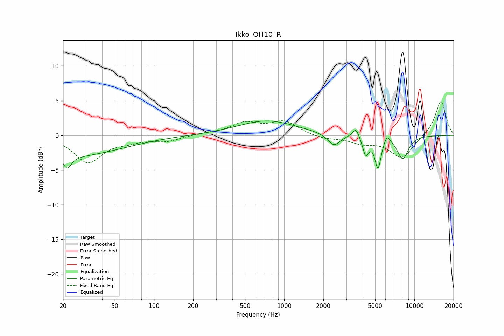

# Ikko_OH10_R
See [usage instructions](https://github.com/jaakkopasanen/AutoEq#usage) for more options and info.

### Parametric EQs
Apply preamp of -2.2 dB when using parametric equalizer.

|   # | Type    |   Fc (Hz) |    Q |   Gain (dB) |
|-----|---------|-----------|------|-------------|
|   1 | Peaking |        22 | 4.7  |        -1.8 |
|   2 | Peaking |        23 | 0.36 |        -3   |
|   3 | Peaking |       736 | 0.63 |         2.1 |
|   4 | Peaking |      2409 | 3    |        -1.7 |
|   5 | Peaking |      3552 | 5.55 |         1.4 |
|   6 | Peaking |      4211 | 5.96 |        -2.1 |
|   7 | Peaking |      4320 | 5.99 |        -0.6 |
|   8 | Peaking |      5256 | 5.85 |        -4.5 |
|   9 | Peaking |      6163 | 6    |         1.1 |
|  10 | Peaking |      8135 | 3.02 |        -3.3 |

### Fixed Band EQs
When using fixed band (also called graphic) equalizer, apply preamp of **-5.0 dB** (if available) and set gains manually with these parameters.

|   # | Type    |   Fc (Hz) |    Q |   Gain (dB) |
|-----|---------|-----------|------|-------------|
|   1 | Peaking |        31 | 1.41 |        -3.8 |
|   2 | Peaking |        62 | 1.41 |        -0.6 |
|   3 | Peaking |       125 | 1.41 |        -0.8 |
|   4 | Peaking |       250 | 1.41 |         0.2 |
|   5 | Peaking |       500 | 1.41 |         1.7 |
|   6 | Peaking |      1000 | 1.41 |         1.9 |
|   7 | Peaking |      2000 | 1.41 |        -0.5 |
|   8 | Peaking |      4000 | 1.41 |        -1   |
|   9 | Peaking |      8000 | 1.41 |        -3.3 |
|  10 | Peaking |     16000 | 1.41 |         5.1 |

### Graphs

