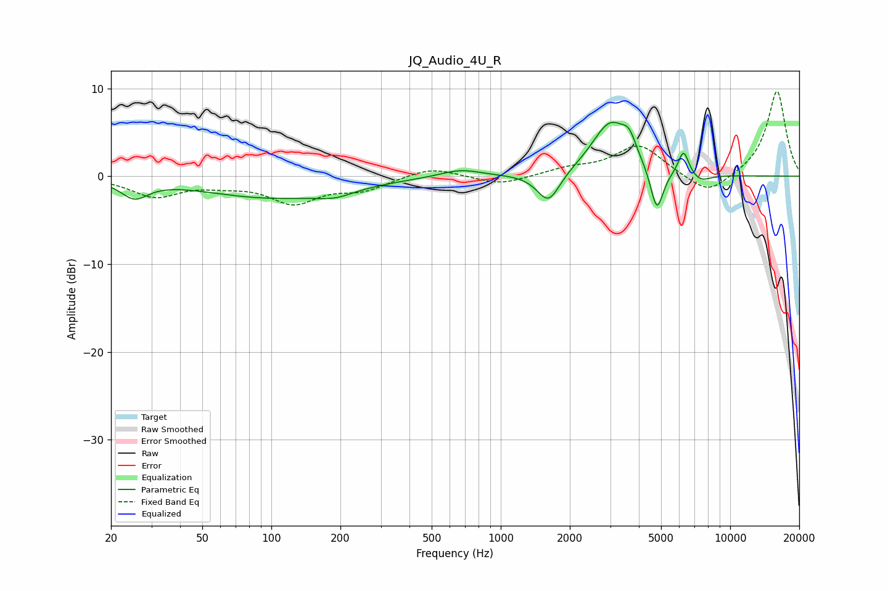

# JQ_Audio_4U_R
See [usage instructions](https://github.com/jaakkopasanen/AutoEq#usage) for more options and info.

### Parametric EQs
Apply preamp of -6.2 dB when using parametric equalizer.

|   # | Type    |   Fc (Hz) |    Q |   Gain (dB) |
|-----|---------|-----------|------|-------------|
|   1 | Peaking |        25 | 2.42 |        -2   |
|   2 | Peaking |       100 | 0.46 |        -2.4 |
|   3 | Peaking |       190 | 1.71 |        -0.8 |
|   4 | Peaking |       666 | 1.56 |         0.9 |
|   5 | Peaking |      1616 | 2.84 |        -3.5 |
|   6 | Peaking |      3010 | 1.72 |         6.1 |
|   7 | Peaking |      3629 | 4.74 |         1.9 |
|   8 | Peaking |      4792 | 4.96 |        -5.1 |
|   9 | Peaking |      6266 | 5.99 |         2.8 |
|  10 | Peaking |      7424 | 3    |        -0.9 |

### Fixed Band EQs
When using fixed band (also called graphic) equalizer, apply preamp of **-9.7 dB** (if available) and set gains manually with these parameters.

|   # | Type    |   Fc (Hz) |    Q |   Gain (dB) |
|-----|---------|-----------|------|-------------|
|   1 | Peaking |        31 | 1.41 |        -2.2 |
|   2 | Peaking |        62 | 1.41 |        -0.7 |
|   3 | Peaking |       125 | 1.41 |        -2.9 |
|   4 | Peaking |       250 | 1.41 |        -1.4 |
|   5 | Peaking |       500 | 1.41 |         1.1 |
|   6 | Peaking |      1000 | 1.41 |        -1   |
|   7 | Peaking |      2000 | 1.41 |         0.8 |
|   8 | Peaking |      4000 | 1.41 |         3.5 |
|   9 | Peaking |      8000 | 1.41 |        -2.3 |
|  10 | Peaking |     16000 | 1.41 |         9.8 |

### Graphs

