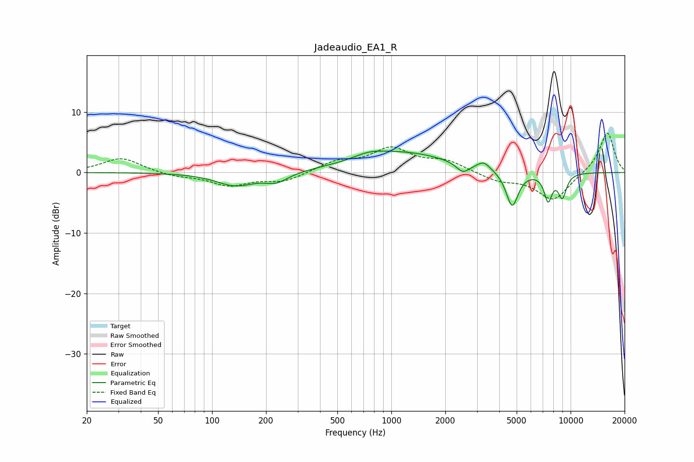

# Jadeaudio_EA1_R
See [usage instructions](https://github.com/jaakkopasanen/AutoEq#usage) for more options and info.

### Parametric EQs
Apply preamp of -3.6 dB when using parametric equalizer.

|   # | Type    |   Fc (Hz) |    Q |   Gain (dB) |
|-----|---------|-----------|------|-------------|
|   1 | Peaking |       135 | 1.31 |        -2.2 |
|   2 | Peaking |       229 | 2.15 |        -1.5 |
|   3 | Peaking |       752 | 1.68 |         0.9 |
|   4 | Peaking |      1162 | 0.54 |         3.2 |
|   5 | Peaking |      2506 | 3.87 |        -1.6 |
|   6 | Peaking |      3276 | 4.03 |         1.2 |
|   7 | Peaking |      4720 | 4.11 |        -5.9 |
|   8 | Peaking |      7491 | 6    |        -4.7 |
|   9 | Peaking |      7547 | 6    |         0.4 |
|  10 | Peaking |      8988 | 5.47 |        -3.9 |

### Fixed Band EQs
When using fixed band (also called graphic) equalizer, apply preamp of **-6.6 dB** (if available) and set gains manually with these parameters.

|   # | Type    |   Fc (Hz) |    Q |   Gain (dB) |
|-----|---------|-----------|------|-------------|
|   1 | Peaking |        31 | 1.41 |         2.4 |
|   2 | Peaking |        62 | 1.41 |        -0.6 |
|   3 | Peaking |       125 | 1.41 |        -2.1 |
|   4 | Peaking |       250 | 1.41 |        -1.5 |
|   5 | Peaking |       500 | 1.41 |         1.7 |
|   6 | Peaking |      1000 | 1.41 |         3.7 |
|   7 | Peaking |      2000 | 1.41 |         1.8 |
|   8 | Peaking |      4000 | 1.41 |        -1.3 |
|   9 | Peaking |      8000 | 1.41 |        -4.6 |
|  10 | Peaking |     16000 | 1.41 |         6.8 |

### Graphs

