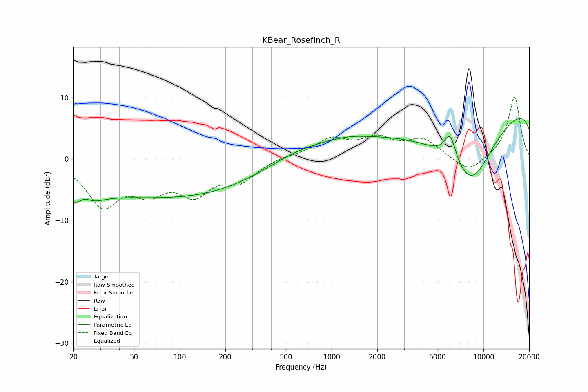

# KBear_Rosefinch_R
See [usage instructions](https://github.com/jaakkopasanen/AutoEq#usage) for more options and info.

### Parametric EQs
Apply preamp of -6.7 dB when using parametric equalizer.

|   # | Type    |   Fc (Hz) |    Q |   Gain (dB) |
|-----|---------|-----------|------|-------------|
|   1 | Peaking |        20 | 1.74 |        -1.1 |
|   2 | Peaking |        23 | 1.68 |        -6.4 |
|   3 | Peaking |        23 | 2.59 |         4.5 |
|   4 | Peaking |        97 | 0.35 |         0.4 |
|   5 | Peaking |       110 | 0.19 |        -6.9 |
|   6 | Peaking |       581 | 0.49 |         3.6 |
|   7 | Peaking |      1338 | 1.47 |         0.4 |
|   8 | Peaking |      6033 | 3.44 |         4.5 |
|   9 | Peaking |      8252 | 0.47 |       -20   |
|  10 | Peaking |     10000 | 0.18 |        17   |

### Fixed Band EQs
When using fixed band (also called graphic) equalizer, apply preamp of **-10.1 dB** (if available) and set gains manually with these parameters.

|   # | Type    |   Fc (Hz) |    Q |   Gain (dB) |
|-----|---------|-----------|------|-------------|
|   1 | Peaking |        31 | 1.41 |        -7.2 |
|   2 | Peaking |        62 | 1.41 |        -4.3 |
|   3 | Peaking |       125 | 1.41 |        -5   |
|   4 | Peaking |       250 | 1.41 |        -3.2 |
|   5 | Peaking |       500 | 1.41 |         0.5 |
|   6 | Peaking |      1000 | 1.41 |         3   |
|   7 | Peaking |      2000 | 1.41 |         2.9 |
|   8 | Peaking |      4000 | 1.41 |         3   |
|   9 | Peaking |      8000 | 1.41 |        -2.4 |
|  10 | Peaking |     16000 | 1.41 |        10.2 |

### Graphs

