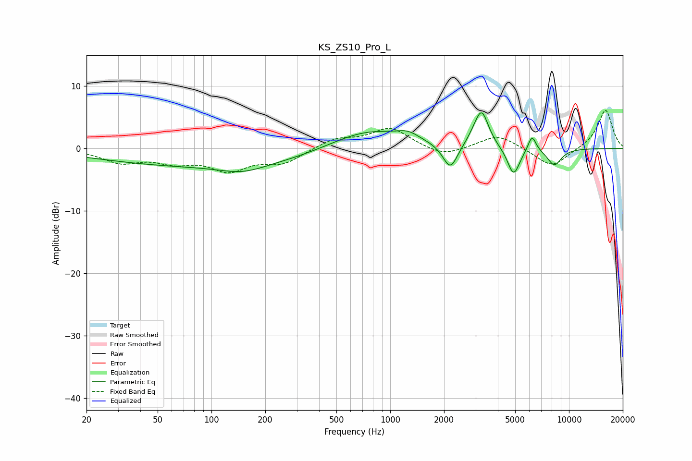

# KS_ZS10_Pro_L
See [usage instructions](https://github.com/jaakkopasanen/AutoEq#usage) for more options and info.

### Parametric EQs
Apply preamp of -5.8 dB when using parametric equalizer.

|   # | Type    |   Fc (Hz) |    Q |   Gain (dB) |
|-----|---------|-----------|------|-------------|
|   1 | Peaking |       104 | 0.2  |        -2.9 |
|   2 | Peaking |       149 | 1.15 |        -1.2 |
|   3 | Peaking |       738 | 0.64 |         3.5 |
|   4 | Peaking |      1257 | 2.34 |         1.1 |
|   5 | Peaking |      2168 | 3.35 |        -4.2 |
|   6 | Peaking |      3015 | 2.85 |         1.2 |
|   7 | Peaking |      3253 | 3.68 |         5.1 |
|   8 | Peaking |      4901 | 4.04 |        -4.5 |
|   9 | Peaking |      6215 | 5.99 |         2.6 |
|  10 | Peaking |      8287 | 3.28 |        -2.7 |

### Fixed Band EQs
When using fixed band (also called graphic) equalizer, apply preamp of **-6.2 dB** (if available) and set gains manually with these parameters.

|   # | Type    |   Fc (Hz) |    Q |   Gain (dB) |
|-----|---------|-----------|------|-------------|
|   1 | Peaking |        31 | 1.41 |        -2.1 |
|   2 | Peaking |        62 | 1.41 |        -1.8 |
|   3 | Peaking |       125 | 1.41 |        -3.2 |
|   4 | Peaking |       250 | 1.41 |        -2.2 |
|   5 | Peaking |       500 | 1.41 |         1.5 |
|   6 | Peaking |      1000 | 1.41 |         3.2 |
|   7 | Peaking |      2000 | 1.41 |        -1.4 |
|   8 | Peaking |      4000 | 1.41 |         2.3 |
|   9 | Peaking |      8000 | 1.41 |        -3.1 |
|  10 | Peaking |     16000 | 1.41 |         6.3 |

### Graphs

