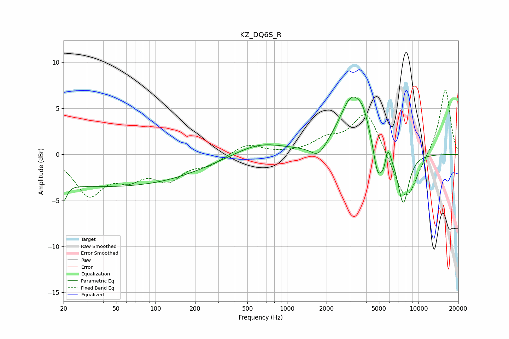

# KZ_DQ6S_R
See [usage instructions](https://github.com/jaakkopasanen/AutoEq#usage) for more options and info.

### Parametric EQs
Apply preamp of -6.3 dB when using parametric equalizer.

|   # | Type    |   Fc (Hz) |    Q |   Gain (dB) |
|-----|---------|-----------|------|-------------|
|   1 | Peaking |        20 | 5.85 |        -1.8 |
|   2 | Peaking |        43 | 0.18 |        -3.5 |
|   3 | Peaking |       618 | 0.74 |         1.3 |
|   4 | Peaking |      1732 | 2.49 |        -1.4 |
|   5 | Peaking |      3113 | 1.48 |         6   |
|   6 | Peaking |      3799 | 3.31 |         1.5 |
|   7 | Peaking |      4877 | 4.51 |        -3.2 |
|   8 | Peaking |      5444 | 5.09 |        -1.9 |
|   9 | Peaking |      5826 | 6    |         2   |
|  10 | Peaking |      7656 | 3.11 |        -5.7 |

### Fixed Band EQs
When using fixed band (also called graphic) equalizer, apply preamp of **-7.1 dB** (if available) and set gains manually with these parameters.

|   # | Type    |   Fc (Hz) |    Q |   Gain (dB) |
|-----|---------|-----------|------|-------------|
|   1 | Peaking |        31 | 1.41 |        -4.2 |
|   2 | Peaking |        62 | 1.41 |        -2   |
|   3 | Peaking |       125 | 1.41 |        -2.4 |
|   4 | Peaking |       250 | 1.41 |        -1   |
|   5 | Peaking |       500 | 1.41 |         1.1 |
|   6 | Peaking |      1000 | 1.41 |         0   |
|   7 | Peaking |      2000 | 1.41 |         1.4 |
|   8 | Peaking |      4000 | 1.41 |         4.8 |
|   9 | Peaking |      8000 | 1.41 |        -5.6 |
|  10 | Peaking |     16000 | 1.41 |         7.3 |

### Graphs

