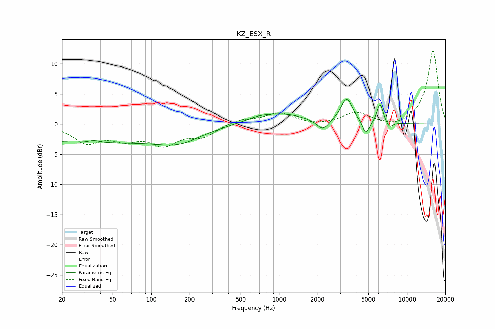

# KZ_ESX_R
See [usage instructions](https://github.com/jaakkopasanen/AutoEq#usage) for more options and info.

### Parametric EQs
Apply preamp of -4.2 dB when using parametric equalizer.

|   # | Type    |   Fc (Hz) |    Q |   Gain (dB) |
|-----|---------|-----------|------|-------------|
|   1 | Peaking |        32 | 0.21 |        -3   |
|   2 | Peaking |        36 | 3.4  |         0.4 |
|   3 | Peaking |       165 | 0.82 |        -2   |
|   4 | Peaking |       677 | 1.63 |         0.5 |
|   5 | Peaking |      1043 | 0.75 |         1.7 |
|   6 | Peaking |      2200 | 2.88 |        -1.8 |
|   7 | Peaking |      3377 | 2.94 |         4.1 |
|   8 | Peaking |      4764 | 5.01 |        -2.4 |
|   9 | Peaking |      6150 | 5.88 |         3.3 |
|  10 | Peaking |      7326 | 6    |        -0.9 |

### Fixed Band EQs
When using fixed band (also called graphic) equalizer, apply preamp of **-12.2 dB** (if available) and set gains manually with these parameters.

|   # | Type    |   Fc (Hz) |    Q |   Gain (dB) |
|-----|---------|-----------|------|-------------|
|   1 | Peaking |        31 | 1.41 |        -2.9 |
|   2 | Peaking |        62 | 1.41 |        -2.1 |
|   3 | Peaking |       125 | 1.41 |        -3.1 |
|   4 | Peaking |       250 | 1.41 |        -1.9 |
|   5 | Peaking |       500 | 1.41 |         0.8 |
|   6 | Peaking |      1000 | 1.41 |         1.8 |
|   7 | Peaking |      2000 | 1.41 |        -0.3 |
|   8 | Peaking |      4000 | 1.41 |         1.9 |
|   9 | Peaking |      8000 | 1.41 |        -0.7 |
|  10 | Peaking |     16000 | 1.41 |        12.2 |

### Graphs

