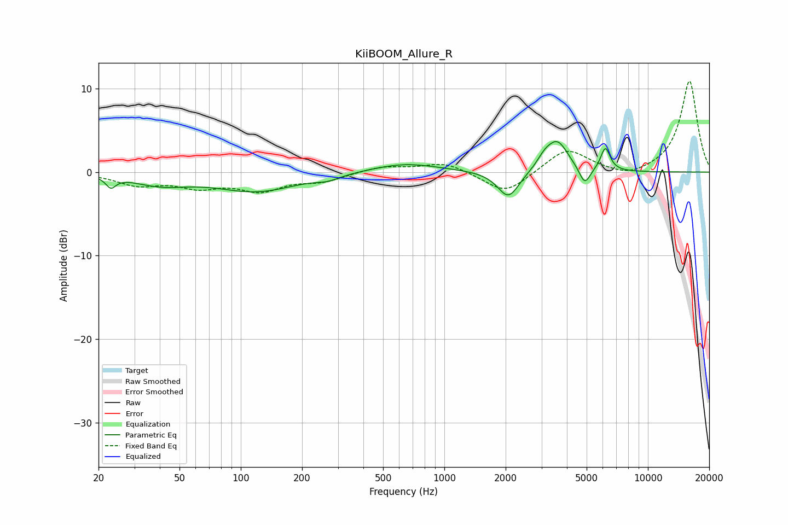

# KiiBOOM_Allure_R
See [usage instructions](https://github.com/jaakkopasanen/AutoEq#usage) for more options and info.

### Parametric EQs
Apply preamp of -3.7 dB when using parametric equalizer.

|   # | Type    |   Fc (Hz) |    Q |   Gain (dB) |
|-----|---------|-----------|------|-------------|
|   1 | Peaking |        23 | 6    |        -1.3 |
|   2 | Peaking |        40 | 1.03 |        -1.3 |
|   3 | Peaking |       120 | 0.72 |        -2.2 |
|   4 | Peaking |       268 | 2.4  |        -0.5 |
|   5 | Peaking |       640 | 0.86 |         1.1 |
|   6 | Peaking |      2064 | 2.66 |        -3.3 |
|   7 | Peaking |      3097 | 3.95 |         1   |
|   8 | Peaking |      3590 | 2.6  |         3.6 |
|   9 | Peaking |      4895 | 5.08 |        -2.2 |
|  10 | Peaking |      6180 | 5.97 |         2.8 |

### Fixed Band EQs
When using fixed band (also called graphic) equalizer, apply preamp of **-11.0 dB** (if available) and set gains manually with these parameters.

|   # | Type    |   Fc (Hz) |    Q |   Gain (dB) |
|-----|---------|-----------|------|-------------|
|   1 | Peaking |        31 | 1.41 |        -1.4 |
|   2 | Peaking |        62 | 1.41 |        -1.5 |
|   3 | Peaking |       125 | 1.41 |        -2   |
|   4 | Peaking |       250 | 1.41 |        -1   |
|   5 | Peaking |       500 | 1.41 |         0.7 |
|   6 | Peaking |      1000 | 1.41 |         1.2 |
|   7 | Peaking |      2000 | 1.41 |        -2.7 |
|   8 | Peaking |      4000 | 1.41 |         2.9 |
|   9 | Peaking |      8000 | 1.41 |        -0.8 |
|  10 | Peaking |     16000 | 1.41 |        11   |

### Graphs

