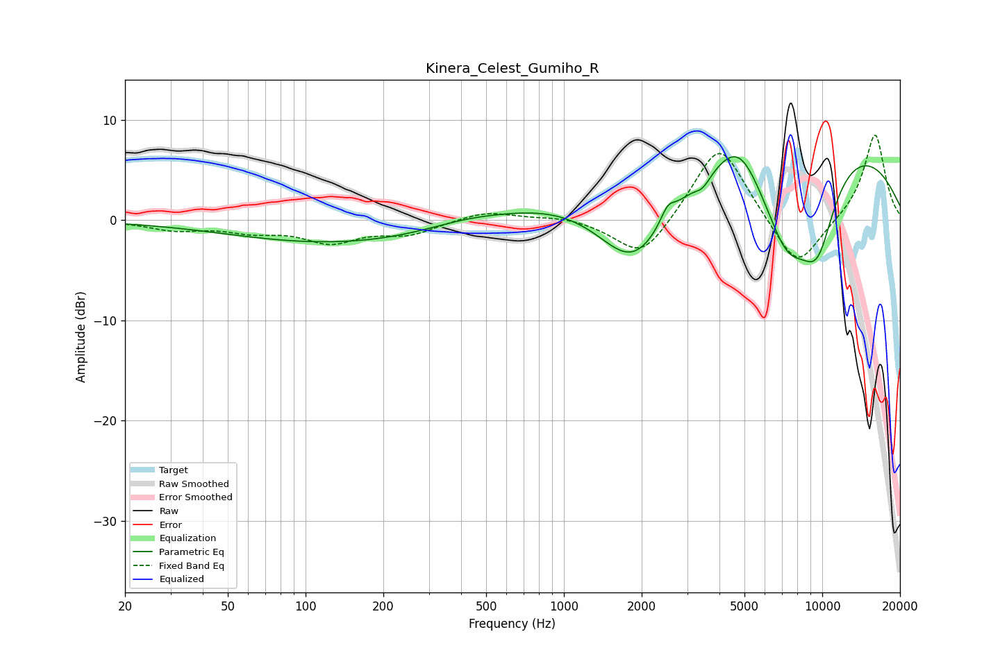

# Kinera_Celest_Gumiho_R
See [usage instructions](https://github.com/jaakkopasanen/AutoEq#usage) for more options and info.

### Parametric EQs
Apply preamp of -6.4 dB when using parametric equalizer.

|   # | Type    |   Fc (Hz) |    Q |   Gain (dB) |
|-----|---------|-----------|------|-------------|
|   1 | Peaking |       136 | 0.33 |        -2.3 |
|   2 | Peaking |       406 | 0.95 |         0.6 |
|   3 | Peaking |      1860 | 0.98 |        -7.5 |
|   4 | Peaking |      2074 | 0.65 |        -3.7 |
|   5 | Peaking |      2522 | 5.2  |         1.4 |
|   6 | Peaking |      3448 | 4.43 |        -1.1 |
|   7 | Peaking |      4767 | 1.73 |         3.4 |
|   8 | Peaking |      5909 | 0.19 |        11.6 |
|   9 | Peaking |      7293 | 1.09 |       -11.3 |
|  10 | Peaking |      9580 | 1.73 |        -7.5 |

### Fixed Band EQs
When using fixed band (also called graphic) equalizer, apply preamp of **-8.6 dB** (if available) and set gains manually with these parameters.

|   # | Type    |   Fc (Hz) |    Q |   Gain (dB) |
|-----|---------|-----------|------|-------------|
|   1 | Peaking |        31 | 1.41 |        -0.9 |
|   2 | Peaking |        62 | 1.41 |        -0.9 |
|   3 | Peaking |       125 | 1.41 |        -2   |
|   4 | Peaking |       250 | 1.41 |        -1.3 |
|   5 | Peaking |       500 | 1.41 |         0.9 |
|   6 | Peaking |      1000 | 1.41 |         0.4 |
|   7 | Peaking |      2000 | 1.41 |        -4.1 |
|   8 | Peaking |      4000 | 1.41 |         8   |
|   9 | Peaking |      8000 | 1.41 |        -5.3 |
|  10 | Peaking |     16000 | 1.41 |         8.7 |

### Graphs

