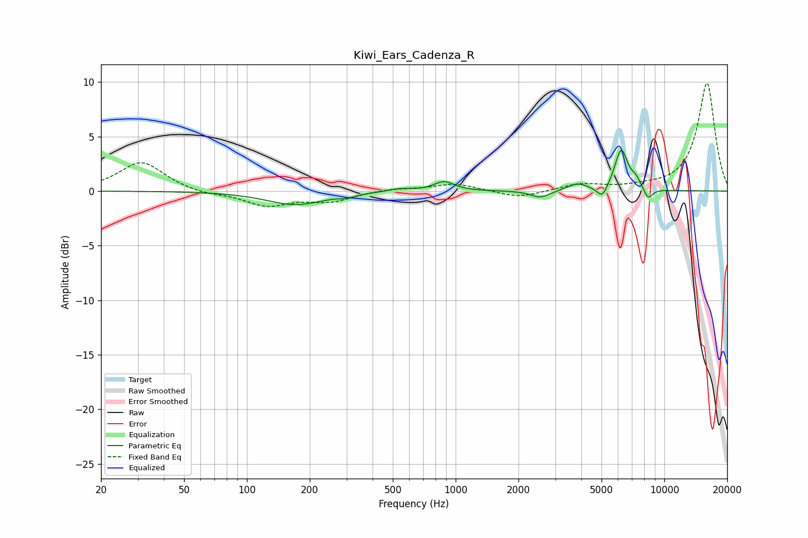

# Kiwi_Ears_Cadenza_R
See [usage instructions](https://github.com/jaakkopasanen/AutoEq#usage) for more options and info.

### Parametric EQs
Apply preamp of -3.8 dB when using parametric equalizer.

|   # | Type    |   Fc (Hz) |    Q |   Gain (dB) |
|-----|---------|-----------|------|-------------|
|   1 | Peaking |       171 | 1.02 |        -1.2 |
|   2 | Peaking |       303 | 4.46 |        -0.2 |
|   3 | Peaking |       536 | 2.43 |         0.3 |
|   4 | Peaking |       880 | 2.93 |         0.9 |
|   5 | Peaking |      2542 | 3.16 |        -0.7 |
|   6 | Peaking |      3827 | 3.01 |         0.6 |
|   7 | Peaking |      5044 | 5.55 |        -1.1 |
|   8 | Peaking |      6216 | 4.33 |         3.8 |
|   9 | Peaking |      7318 | 5.99 |         0.7 |
|  10 | Peaking |      8361 | 6    |        -1   |

### Fixed Band EQs
When using fixed band (also called graphic) equalizer, apply preamp of **-10.0 dB** (if available) and set gains manually with these parameters.

|   # | Type    |   Fc (Hz) |    Q |   Gain (dB) |
|-----|---------|-----------|------|-------------|
|   1 | Peaking |        31 | 1.41 |         2.7 |
|   2 | Peaking |        62 | 1.41 |        -0.3 |
|   3 | Peaking |       125 | 1.41 |        -1.3 |
|   4 | Peaking |       250 | 1.41 |        -0.9 |
|   5 | Peaking |       500 | 1.41 |         0.2 |
|   6 | Peaking |      1000 | 1.41 |         0.7 |
|   7 | Peaking |      2000 | 1.41 |        -0.7 |
|   8 | Peaking |      4000 | 1.41 |         0.6 |
|   9 | Peaking |      8000 | 1.41 |         0.3 |
|  10 | Peaking |     16000 | 1.41 |         9.9 |

### Graphs

