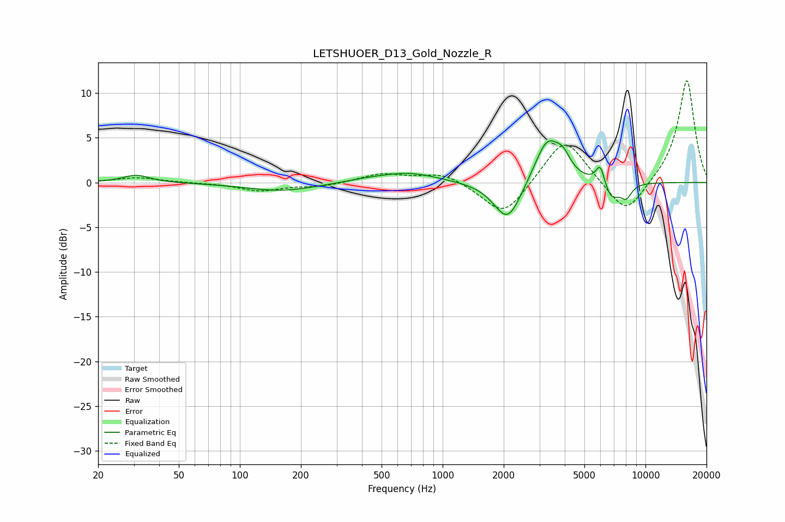

# LETSHUOER_D13_Gold_Nozzle_R
See [usage instructions](https://github.com/jaakkopasanen/AutoEq#usage) for more options and info.

### Parametric EQs
Apply preamp of -4.7 dB when using parametric equalizer.

|   # | Type    |   Fc (Hz) |    Q |   Gain (dB) |
|-----|---------|-----------|------|-------------|
|   1 | Peaking |        31 | 2.16 |         0.8 |
|   2 | Peaking |       160 | 0.8  |        -1   |
|   3 | Peaking |       436 | 1.12 |         0.3 |
|   4 | Peaking |       691 | 1.01 |         1   |
|   5 | Peaking |      2094 | 2.07 |        -4.7 |
|   6 | Peaking |      3282 | 2.19 |         5   |
|   7 | Peaking |      3929 | 3.9  |         1.6 |
|   8 | Peaking |      5996 | 6    |         2.4 |
|   9 | Peaking |      6757 | 3.21 |        -2.1 |
|  10 | Peaking |      8038 | 4.88 |        -1.4 |

### Fixed Band EQs
When using fixed band (also called graphic) equalizer, apply preamp of **-11.5 dB** (if available) and set gains manually with these parameters.

|   # | Type    |   Fc (Hz) |    Q |   Gain (dB) |
|-----|---------|-----------|------|-------------|
|   1 | Peaking |        31 | 1.41 |         0.5 |
|   2 | Peaking |        62 | 1.41 |        -0   |
|   3 | Peaking |       125 | 1.41 |        -0.9 |
|   4 | Peaking |       250 | 1.41 |        -0.4 |
|   5 | Peaking |       500 | 1.41 |         1   |
|   6 | Peaking |      1000 | 1.41 |         1.1 |
|   7 | Peaking |      2000 | 1.41 |        -4   |
|   8 | Peaking |      4000 | 1.41 |         5.3 |
|   9 | Peaking |      8000 | 1.41 |        -4   |
|  10 | Peaking |     16000 | 1.41 |        11.6 |

### Graphs

