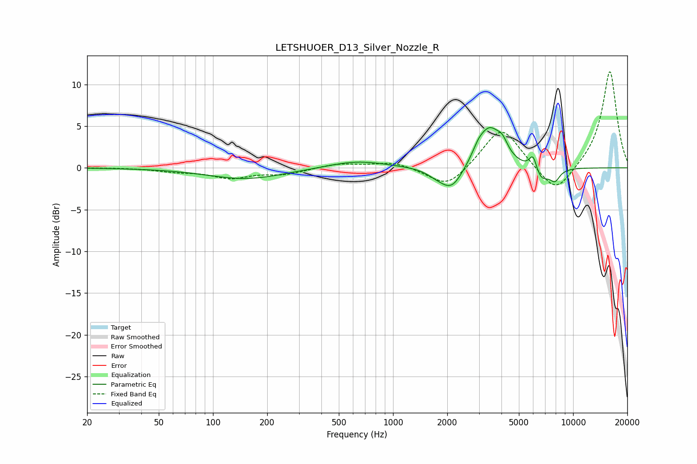

# LETSHUOER_D13_Silver_Nozzle_R
See [usage instructions](https://github.com/jaakkopasanen/AutoEq#usage) for more options and info.

### Parametric EQs
Apply preamp of -4.9 dB when using parametric equalizer.

|   # | Type    |   Fc (Hz) |    Q |   Gain (dB) |
|-----|---------|-----------|------|-------------|
|   1 | Peaking |       152 | 0.66 |        -1.3 |
|   2 | Peaking |       629 | 0.88 |         0.9 |
|   3 | Peaking |      1724 | 2.74 |        -0.5 |
|   4 | Peaking |      2114 | 2.17 |        -2.8 |
|   5 | Peaking |      2974 | 4.58 |         0.8 |
|   6 | Peaking |      3428 | 2.1  |         4.8 |
|   7 | Peaking |      4055 | 4.85 |         1.2 |
|   8 | Peaking |      6008 | 6    |         2.3 |
|   9 | Peaking |      6544 | 2.87 |        -2   |
|  10 | Peaking |      7935 | 4.88 |        -1.3 |

### Fixed Band EQs
When using fixed band (also called graphic) equalizer, apply preamp of **-11.6 dB** (if available) and set gains manually with these parameters.

|   # | Type    |   Fc (Hz) |    Q |   Gain (dB) |
|-----|---------|-----------|------|-------------|
|   1 | Peaking |        31 | 1.41 |         0   |
|   2 | Peaking |        62 | 1.41 |        -0.4 |
|   3 | Peaking |       125 | 1.41 |        -1.1 |
|   4 | Peaking |       250 | 1.41 |        -0.7 |
|   5 | Peaking |       500 | 1.41 |         0.5 |
|   6 | Peaking |      1000 | 1.41 |         0.7 |
|   7 | Peaking |      2000 | 1.41 |        -2.5 |
|   8 | Peaking |      4000 | 1.41 |         5   |
|   9 | Peaking |      8000 | 1.41 |        -3.5 |
|  10 | Peaking |     16000 | 1.41 |        11.7 |

### Graphs

