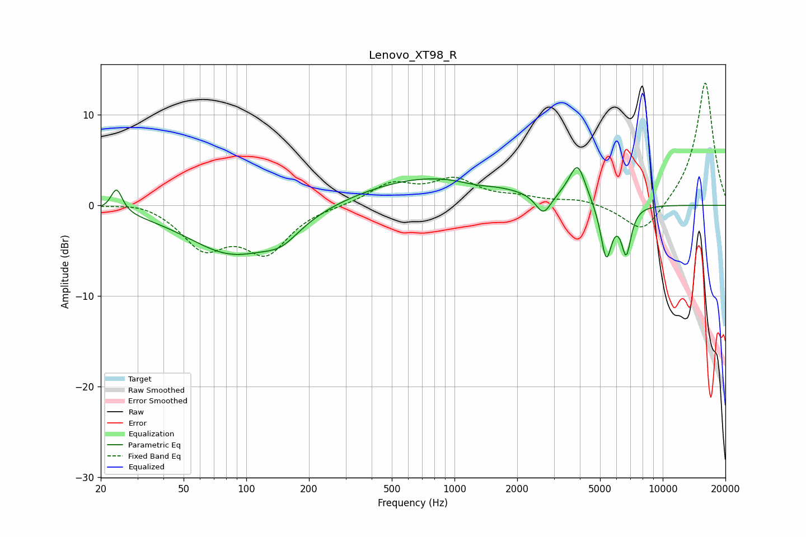

# Lenovo_XT98_R
See [usage instructions](https://github.com/jaakkopasanen/AutoEq#usage) for more options and info.

### Parametric EQs
Apply preamp of -4.3 dB when using parametric equalizer.

|   # | Type    |   Fc (Hz) |    Q |   Gain (dB) |
|-----|---------|-----------|------|-------------|
|   1 | Peaking |        24 | 5.27 |         2.6 |
|   2 | Peaking |        85 | 0.65 |        -5.2 |
|   3 | Peaking |       148 | 1.61 |        -1.8 |
|   4 | Peaking |       793 | 0.39 |         3.2 |
|   5 | Peaking |      1253 | 1.77 |        -0.4 |
|   6 | Peaking |      2671 | 3.79 |        -2.3 |
|   7 | Peaking |      3509 | 2.53 |         0.5 |
|   8 | Peaking |      3908 | 3.7  |         3.9 |
|   9 | Peaking |      5355 | 5.12 |        -6.1 |
|  10 | Peaking |      6678 | 5.76 |        -5.1 |

### Fixed Band EQs
When using fixed band (also called graphic) equalizer, apply preamp of **-13.6 dB** (if available) and set gains manually with these parameters.

|   # | Type    |   Fc (Hz) |    Q |   Gain (dB) |
|-----|---------|-----------|------|-------------|
|   1 | Peaking |        31 | 1.41 |         0.6 |
|   2 | Peaking |        62 | 1.41 |        -4.4 |
|   3 | Peaking |       125 | 1.41 |        -4.9 |
|   4 | Peaking |       250 | 1.41 |        -0   |
|   5 | Peaking |       500 | 1.41 |         2.3 |
|   6 | Peaking |      1000 | 1.41 |         2.6 |
|   7 | Peaking |      2000 | 1.41 |         0.7 |
|   8 | Peaking |      4000 | 1.41 |         0.6 |
|   9 | Peaking |      8000 | 1.41 |        -3.4 |
|  10 | Peaking |     16000 | 1.41 |        13.8 |

### Graphs

