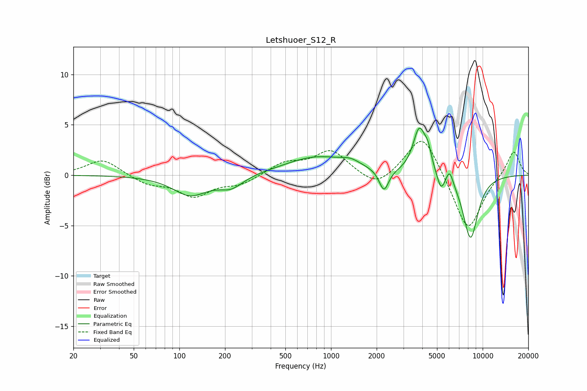

# Letshuoer_S12_R
See [usage instructions](https://github.com/jaakkopasanen/AutoEq#usage) for more options and info.

### Parametric EQs
Apply preamp of -4.8 dB when using parametric equalizer.

|   # | Type    |   Fc (Hz) |    Q |   Gain (dB) |
|-----|---------|-----------|------|-------------|
|   1 | Peaking |       118 | 1.24 |        -2   |
|   2 | Peaking |       219 | 1.77 |        -1.2 |
|   3 | Peaking |       807 | 0.67 |         1.8 |
|   4 | Peaking |      1350 | 2.25 |         0.5 |
|   5 | Peaking |      2235 | 4.55 |        -2.2 |
|   6 | Peaking |      3822 | 3.39 |         4.5 |
|   7 | Peaking |      4359 | 6    |         1.5 |
|   8 | Peaking |      5311 | 5.6  |        -1.6 |
|   9 | Peaking |      6060 | 6    |         1.4 |
|  10 | Peaking |      8318 | 2.58 |        -6.3 |

### Fixed Band EQs
When using fixed band (also called graphic) equalizer, apply preamp of **-3.4 dB** (if available) and set gains manually with these parameters.

|   # | Type    |   Fc (Hz) |    Q |   Gain (dB) |
|-----|---------|-----------|------|-------------|
|   1 | Peaking |        31 | 1.41 |         1.6 |
|   2 | Peaking |        62 | 1.41 |        -0.9 |
|   3 | Peaking |       125 | 1.41 |        -2   |
|   4 | Peaking |       250 | 1.41 |        -0.9 |
|   5 | Peaking |       500 | 1.41 |         1.2 |
|   6 | Peaking |      1000 | 1.41 |         2.4 |
|   7 | Peaking |      2000 | 1.41 |        -1.4 |
|   8 | Peaking |      4000 | 1.41 |         4.3 |
|   9 | Peaking |      8000 | 1.41 |        -5.7 |
|  10 | Peaking |     16000 | 1.41 |         2.5 |

### Graphs

