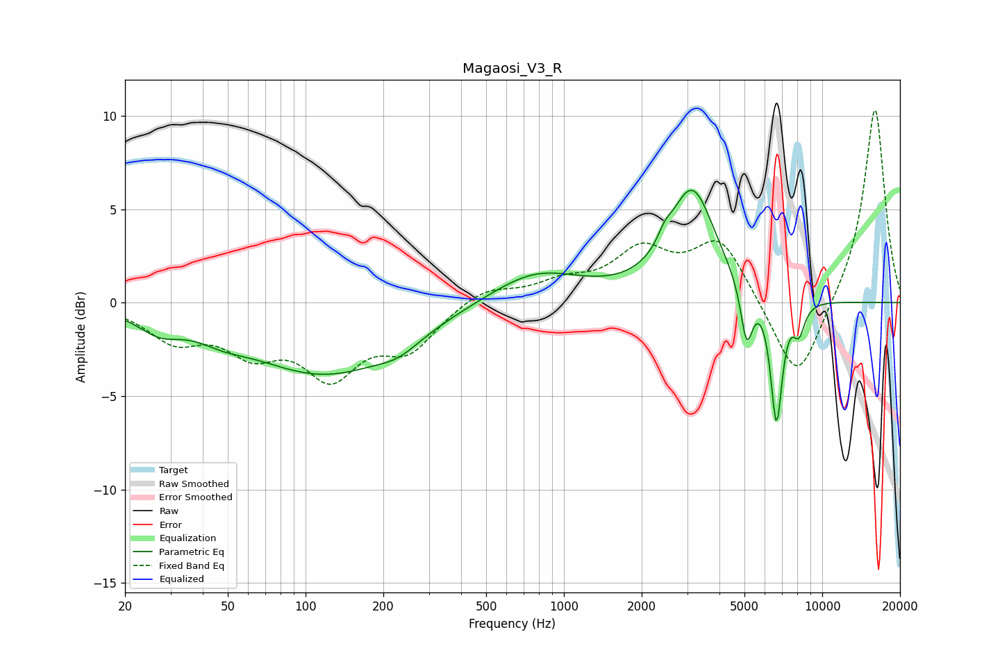

# Magaosi_V3_R
See [usage instructions](https://github.com/jaakkopasanen/AutoEq#usage) for more options and info.

### Parametric EQs
Apply preamp of -6.1 dB when using parametric equalizer.

|   # | Type    |   Fc (Hz) |    Q |   Gain (dB) |
|-----|---------|-----------|------|-------------|
|   1 | Peaking |        27 | 1.75 |        -1   |
|   2 | Peaking |        48 | 1.45 |        -0.6 |
|   3 | Peaking |       119 | 0.48 |        -3.7 |
|   4 | Peaking |       230 | 1.74 |        -0.6 |
|   5 | Peaking |       777 | 0.79 |         1.7 |
|   6 | Peaking |      2457 | 5.45 |         0.6 |
|   7 | Peaking |      3139 | 1.57 |         5.9 |
|   8 | Peaking |      5098 | 6    |        -3.1 |
|   9 | Peaking |      6651 | 6    |        -6.7 |
|  10 | Peaking |      8124 | 5.82 |        -1.5 |

### Fixed Band EQs
When using fixed band (also called graphic) equalizer, apply preamp of **-10.4 dB** (if available) and set gains manually with these parameters.

|   # | Type    |   Fc (Hz) |    Q |   Gain (dB) |
|-----|---------|-----------|------|-------------|
|   1 | Peaking |        31 | 1.41 |        -1.8 |
|   2 | Peaking |        62 | 1.41 |        -2.2 |
|   3 | Peaking |       125 | 1.41 |        -3.5 |
|   4 | Peaking |       250 | 1.41 |        -2.3 |
|   5 | Peaking |       500 | 1.41 |         0.8 |
|   6 | Peaking |      1000 | 1.41 |         0.9 |
|   7 | Peaking |      2000 | 1.41 |         2.5 |
|   8 | Peaking |      4000 | 1.41 |         3.3 |
|   9 | Peaking |      8000 | 1.41 |        -4.6 |
|  10 | Peaking |     16000 | 1.41 |        10.6 |

### Graphs

