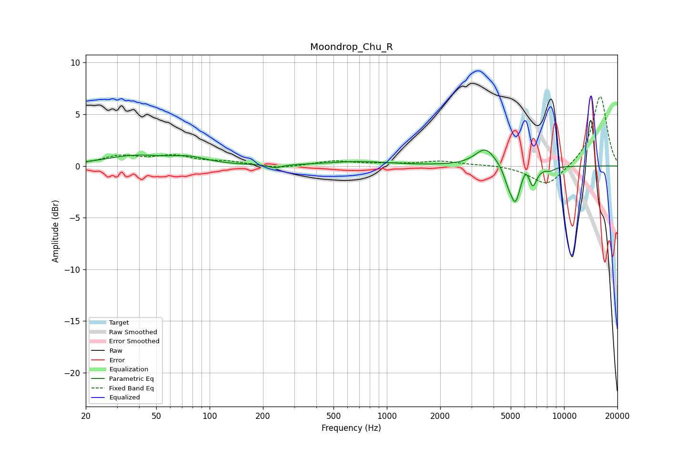

# Moondrop_Chu_R
See [usage instructions](https://github.com/jaakkopasanen/AutoEq#usage) for more options and info.

### Parametric EQs
Apply preamp of -1.6 dB when using parametric equalizer.

|   # | Type    |   Fc (Hz) |    Q |   Gain (dB) |
|-----|---------|-----------|------|-------------|
|   1 | Peaking |        38 | 0.85 |         0.9 |
|   2 | Peaking |        76 | 1.43 |         0.6 |
|   3 | Peaking |       234 | 3.84 |        -0.3 |
|   4 | Peaking |       689 | 0.77 |         0.4 |
|   5 | Peaking |      3600 | 2.43 |         1.8 |
|   6 | Peaking |      4815 | 6    |        -0.9 |
|   7 | Peaking |      5311 | 4.8  |        -3.4 |
|   8 | Peaking |      6100 | 6    |         0.9 |
|   9 | Peaking |      6657 | 6    |        -1.9 |
|  10 | Peaking |      8358 | 4.56 |        -0.3 |

### Fixed Band EQs
When using fixed band (also called graphic) equalizer, apply preamp of **-6.8 dB** (if available) and set gains manually with these parameters.

|   # | Type    |   Fc (Hz) |    Q |   Gain (dB) |
|-----|---------|-----------|------|-------------|
|   1 | Peaking |        31 | 1.41 |         0.9 |
|   2 | Peaking |        62 | 1.41 |         0.9 |
|   3 | Peaking |       125 | 1.41 |         0.3 |
|   4 | Peaking |       250 | 1.41 |        -0.3 |
|   5 | Peaking |       500 | 1.41 |         0.5 |
|   6 | Peaking |      1000 | 1.41 |         0.1 |
|   7 | Peaking |      2000 | 1.41 |         0.4 |
|   8 | Peaking |      4000 | 1.41 |         0.1 |
|   9 | Peaking |      8000 | 1.41 |        -2   |
|  10 | Peaking |     16000 | 1.41 |         6.8 |

### Graphs

