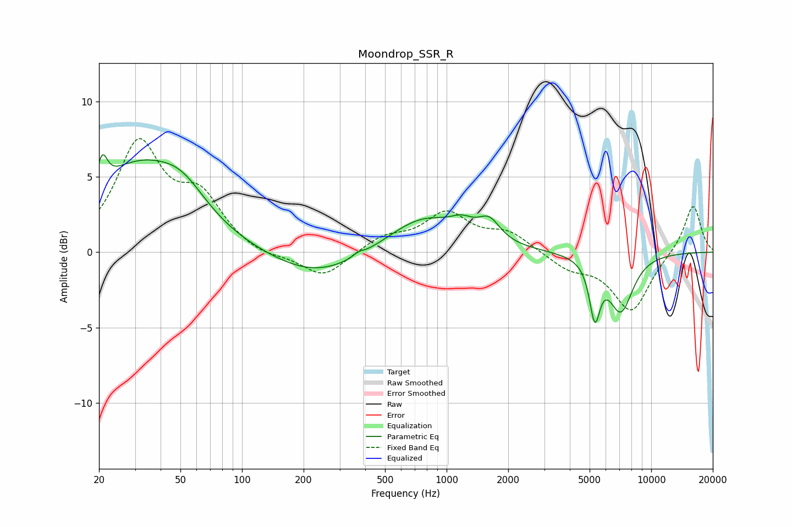

# Moondrop_SSR_R
See [usage instructions](https://github.com/jaakkopasanen/AutoEq#usage) for more options and info.

### Parametric EQs
Apply preamp of -6.6 dB when using parametric equalizer.

|   # | Type    |   Fc (Hz) |    Q |   Gain (dB) |
|-----|---------|-----------|------|-------------|
|   1 | Peaking |        21 | 5.86 |         1.9 |
|   2 | Peaking |        30 | 0.62 |         5.3 |
|   3 | Peaking |        51 | 1.18 |         1.9 |
|   4 | Peaking |       231 | 0.64 |        -1.7 |
|   5 | Peaking |       371 | 5.73 |         0.2 |
|   6 | Peaking |       764 | 0.82 |         2.3 |
|   7 | Peaking |      1188 | 2.55 |         0.8 |
|   8 | Peaking |      1614 | 2.6  |         1.4 |
|   9 | Peaking |      5300 | 5.4  |        -3.6 |
|  10 | Peaking |      7100 | 2.23 |        -3.8 |

### Fixed Band EQs
When using fixed band (also called graphic) equalizer, apply preamp of **-7.6 dB** (if available) and set gains manually with these parameters.

|   # | Type    |   Fc (Hz) |    Q |   Gain (dB) |
|-----|---------|-----------|------|-------------|
|   1 | Peaking |        31 | 1.41 |         7   |
|   2 | Peaking |        62 | 1.41 |         3.2 |
|   3 | Peaking |       125 | 1.41 |        -0.5 |
|   4 | Peaking |       250 | 1.41 |        -1.7 |
|   5 | Peaking |       500 | 1.41 |         0.9 |
|   6 | Peaking |      1000 | 1.41 |         2.5 |
|   7 | Peaking |      2000 | 1.41 |         1.2 |
|   8 | Peaking |      4000 | 1.41 |        -1   |
|   9 | Peaking |      8000 | 1.41 |        -3.9 |
|  10 | Peaking |     16000 | 1.41 |         3.2 |

### Graphs

