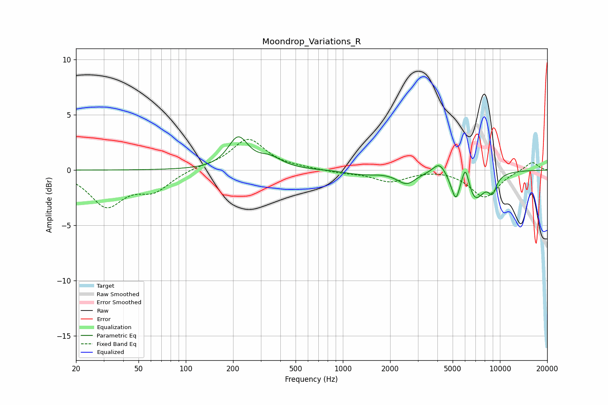

# Moondrop_Variations_R
See [usage instructions](https://github.com/jaakkopasanen/AutoEq#usage) for more options and info.

### Parametric EQs
Apply preamp of -3.1 dB when using parametric equalizer.

|   # | Type    |   Fc (Hz) |    Q |   Gain (dB) |
|-----|---------|-----------|------|-------------|
|   1 | Peaking |       215 | 2.23 |         2.8 |
|   2 | Peaking |       345 | 1.87 |         0.9 |
|   3 | Peaking |      1313 | 1.38 |        -0.4 |
|   4 | Peaking |      2544 | 2.33 |        -1.1 |
|   5 | Peaking |      4122 | 3.38 |         1.1 |
|   6 | Peaking |      5013 | 4.47 |        -0.7 |
|   7 | Peaking |      5265 | 5.99 |        -1.7 |
|   8 | Peaking |      6038 | 6    |         2   |
|   9 | Peaking |      6948 | 2.28 |        -2.6 |
|  10 | Peaking |      8965 | 4.67 |        -1.4 |

### Fixed Band EQs
When using fixed band (also called graphic) equalizer, apply preamp of **-2.9 dB** (if available) and set gains manually with these parameters.

|   # | Type    |   Fc (Hz) |    Q |   Gain (dB) |
|-----|---------|-----------|------|-------------|
|   1 | Peaking |        31 | 1.41 |        -3.1 |
|   2 | Peaking |        62 | 1.41 |        -1.7 |
|   3 | Peaking |       125 | 1.41 |         0.3 |
|   4 | Peaking |       250 | 1.41 |         2.8 |
|   5 | Peaking |       500 | 1.41 |         0.1 |
|   6 | Peaking |      1000 | 1.41 |        -0.2 |
|   7 | Peaking |      2000 | 1.41 |        -1   |
|   8 | Peaking |      4000 | 1.41 |         0.1 |
|   9 | Peaking |      8000 | 1.41 |        -2.5 |
|  10 | Peaking |     16000 | 1.41 |         0.8 |

### Graphs

