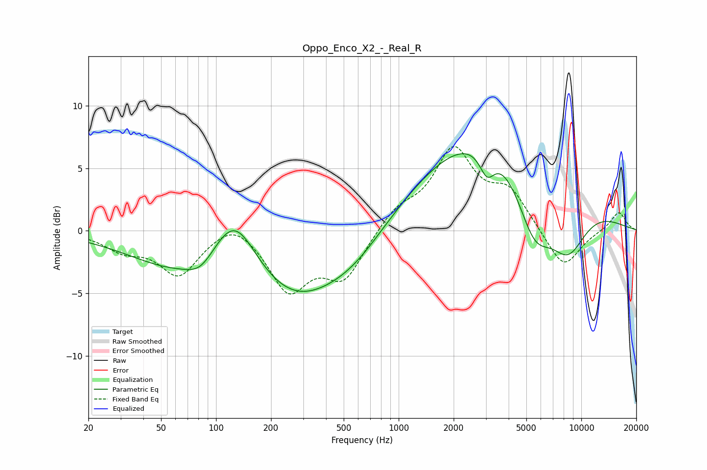

# Oppo_Enco_X2_-_Real_R
See [usage instructions](https://github.com/jaakkopasanen/AutoEq#usage) for more options and info.

### Parametric EQs
Apply preamp of -6.3 dB when using parametric equalizer.

|   # | Type    |   Fc (Hz) |    Q |   Gain (dB) |
|-----|---------|-----------|------|-------------|
|   1 | Peaking |        65 | 0.5  |        -2.9 |
|   2 | Peaking |        82 | 1.96 |        -1.1 |
|   3 | Peaking |       126 | 1.13 |         5.2 |
|   4 | Peaking |       268 | 0.52 |        -5.2 |
|   5 | Peaking |       575 | 0.81 |        -1.5 |
|   6 | Peaking |      1939 | 0.41 |         1.9 |
|   7 | Peaking |      3047 | 3.4  |        -2.1 |
|   8 | Peaking |      4085 | 0.35 |         7.4 |
|   9 | Peaking |      5519 | 1.28 |        -6.3 |
|  10 | Peaking |      8415 | 1.17 |        -5.2 |

### Fixed Band EQs
When using fixed band (also called graphic) equalizer, apply preamp of **-6.8 dB** (if available) and set gains manually with these parameters.

|   # | Type    |   Fc (Hz) |    Q |   Gain (dB) |
|-----|---------|-----------|------|-------------|
|   1 | Peaking |        31 | 1.41 |        -1.3 |
|   2 | Peaking |        62 | 1.41 |        -3.4 |
|   3 | Peaking |       125 | 1.41 |         1.3 |
|   4 | Peaking |       250 | 1.41 |        -4.6 |
|   5 | Peaking |       500 | 1.41 |        -3.6 |
|   6 | Peaking |      1000 | 1.41 |         1.6 |
|   7 | Peaking |      2000 | 1.41 |         6.2 |
|   8 | Peaking |      4000 | 1.41 |         2.9 |
|   9 | Peaking |      8000 | 1.41 |        -3.2 |
|  10 | Peaking |     16000 | 1.41 |         1.6 |

### Graphs

