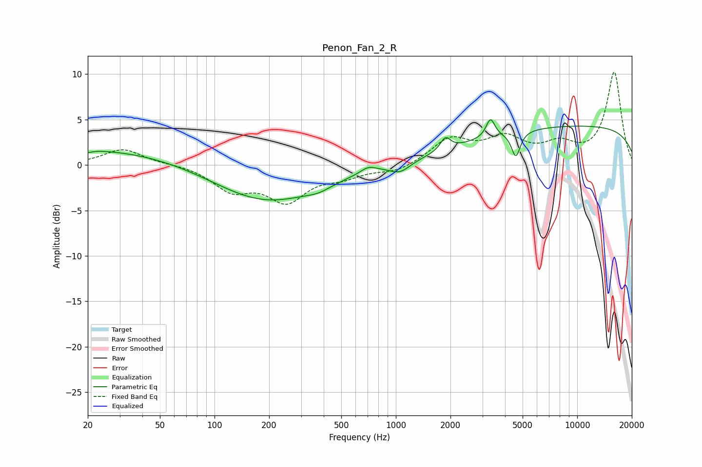

# Penon_Fan_2_R
See [usage instructions](https://github.com/jaakkopasanen/AutoEq#usage) for more options and info.

### Parametric EQs
Apply preamp of -5.1 dB when using parametric equalizer.

|   # | Type    |   Fc (Hz) |    Q |   Gain (dB) |
|-----|---------|-----------|------|-------------|
|   1 | Peaking |        20 | 5.92 |        -0.3 |
|   2 | Peaking |        20 | 0.25 |         1.8 |
|   3 | Peaking |       195 | 0.48 |        -4.1 |
|   4 | Peaking |       375 | 2.08 |        -0.5 |
|   5 | Peaking |       705 | 3.26 |         0.7 |
|   6 | Peaking |      1055 | 2.5  |        -1.1 |
|   7 | Peaking |      1877 | 5.14 |         1.4 |
|   8 | Peaking |      3324 | 6    |         2.1 |
|   9 | Peaking |      4589 | 5.88 |        -2.8 |
|  10 | Peaking |     10000 | 0.18 |         4.3 |

### Fixed Band EQs
When using fixed band (also called graphic) equalizer, apply preamp of **-10.3 dB** (if available) and set gains manually with these parameters.

|   # | Type    |   Fc (Hz) |    Q |   Gain (dB) |
|-----|---------|-----------|------|-------------|
|   1 | Peaking |        31 | 1.41 |         1.8 |
|   2 | Peaking |        62 | 1.41 |         0.1 |
|   3 | Peaking |       125 | 1.41 |        -2.6 |
|   4 | Peaking |       250 | 1.41 |        -3.7 |
|   5 | Peaking |       500 | 1.41 |        -1.1 |
|   6 | Peaking |      1000 | 1.41 |        -0.8 |
|   7 | Peaking |      2000 | 1.41 |         2.7 |
|   8 | Peaking |      4000 | 1.41 |         2.6 |
|   9 | Peaking |      8000 | 1.41 |         1.9 |
|  10 | Peaking |     16000 | 1.41 |        10.1 |

### Graphs

