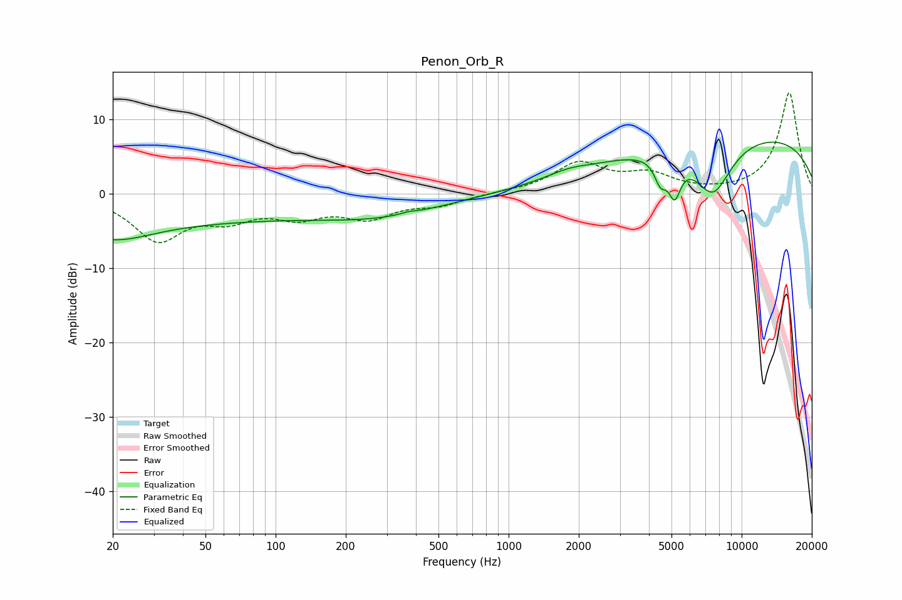

# Penon_Orb_R
See [usage instructions](https://github.com/jaakkopasanen/AutoEq#usage) for more options and info.

### Parametric EQs
Apply preamp of -7.0 dB when using parametric equalizer.

|   # | Type    |   Fc (Hz) |    Q |   Gain (dB) |
|-----|---------|-----------|------|-------------|
|   1 | Peaking |        20 | 0.84 |        -2.7 |
|   2 | Peaking |        29 | 0.19 |        -3.5 |
|   3 | Peaking |       281 | 0.51 |        -2.5 |
|   4 | Peaking |       371 | 4.63 |         0.2 |
|   5 | Peaking |      1803 | 1.61 |         0.7 |
|   6 | Peaking |      4496 | 5.33 |        -3.8 |
|   7 | Peaking |      4537 | 5.97 |         0.7 |
|   8 | Peaking |      5159 | 5.27 |        -4.6 |
|   9 | Peaking |      7522 | 1.6  |        -7.4 |
|  10 | Peaking |      9763 | 0.21 |         8.2 |

### Fixed Band EQs
When using fixed band (also called graphic) equalizer, apply preamp of **-13.7 dB** (if available) and set gains manually with these parameters.

|   # | Type    |   Fc (Hz) |    Q |   Gain (dB) |
|-----|---------|-----------|------|-------------|
|   1 | Peaking |        31 | 1.41 |        -5.9 |
|   2 | Peaking |        62 | 1.41 |        -2.7 |
|   3 | Peaking |       125 | 1.41 |        -2.6 |
|   4 | Peaking |       250 | 1.41 |        -2.9 |
|   5 | Peaking |       500 | 1.41 |        -1.3 |
|   6 | Peaking |      1000 | 1.41 |         0.2 |
|   7 | Peaking |      2000 | 1.41 |         4   |
|   8 | Peaking |      4000 | 1.41 |         2.3 |
|   9 | Peaking |      8000 | 1.41 |         0   |
|  10 | Peaking |     16000 | 1.41 |        13.7 |

### Graphs

