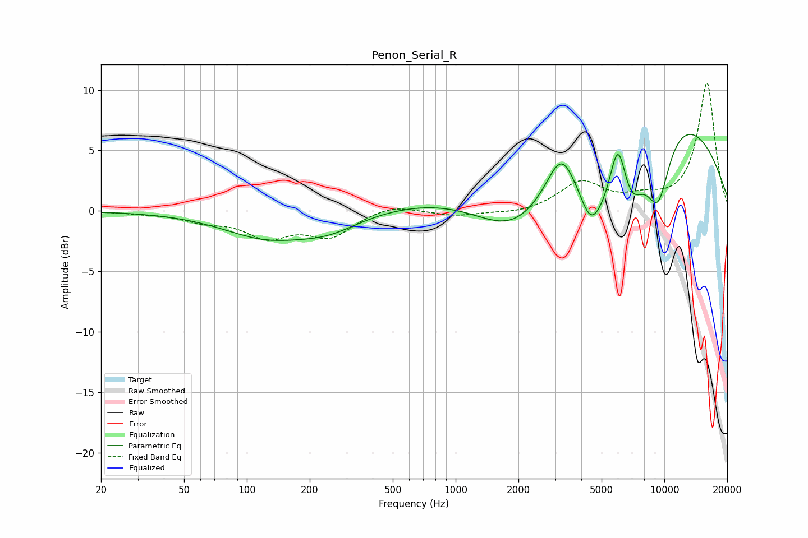

# Penon_Serial_R
See [usage instructions](https://github.com/jaakkopasanen/AutoEq#usage) for more options and info.

### Parametric EQs
Apply preamp of -6.4 dB when using parametric equalizer.

|   # | Type    |   Fc (Hz) |    Q |   Gain (dB) |
|-----|---------|-----------|------|-------------|
|   1 | Peaking |       123 | 0.68 |        -2   |
|   2 | Peaking |       246 | 0.93 |        -1.3 |
|   3 | Peaking |      1963 | 0.57 |        -8.8 |
|   4 | Peaking |      3207 | 2.1  |         3.5 |
|   5 | Peaking |      4411 | 3    |        -2   |
|   6 | Peaking |      5010 | 1.08 |        -6.5 |
|   7 | Peaking |      5428 | 0.18 |        11   |
|   8 | Peaking |      6000 | 3.27 |         5.8 |
|   9 | Peaking |      6850 | 1.86 |        -4.5 |
|  10 | Peaking |      9331 | 2.13 |        -5.8 |

### Fixed Band EQs
When using fixed band (also called graphic) equalizer, apply preamp of **-10.7 dB** (if available) and set gains manually with these parameters.

|   # | Type    |   Fc (Hz) |    Q |   Gain (dB) |
|-----|---------|-----------|------|-------------|
|   1 | Peaking |        31 | 1.41 |        -0.1 |
|   2 | Peaking |        62 | 1.41 |        -0.7 |
|   3 | Peaking |       125 | 1.41 |        -2   |
|   4 | Peaking |       250 | 1.41 |        -2   |
|   5 | Peaking |       500 | 1.41 |         0.6 |
|   6 | Peaking |      1000 | 1.41 |        -0.4 |
|   7 | Peaking |      2000 | 1.41 |        -0.3 |
|   8 | Peaking |      4000 | 1.41 |         2.3 |
|   9 | Peaking |      8000 | 1.41 |         0.8 |
|  10 | Peaking |     16000 | 1.41 |        10.6 |

### Graphs

