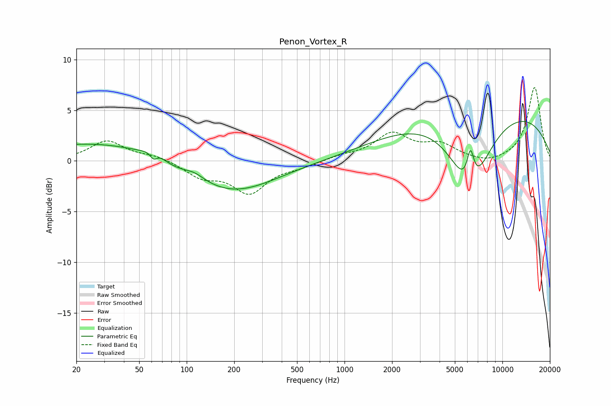

# Penon_Vortex_R
See [usage instructions](https://github.com/jaakkopasanen/AutoEq#usage) for more options and info.

### Parametric EQs
Apply preamp of -4.0 dB when using parametric equalizer.

|   # | Type    |   Fc (Hz) |    Q |   Gain (dB) |
|-----|---------|-----------|------|-------------|
|   1 | Peaking |        46 | 0.19 |         2.1 |
|   2 | Peaking |        62 | 5.42 |        -1.2 |
|   3 | Peaking |        62 | 2.88 |         1.2 |
|   4 | Peaking |        79 | 1.06 |        -0.6 |
|   5 | Peaking |       112 | 2.23 |         0.6 |
|   6 | Peaking |       125 | 0.93 |        -0.2 |
|   7 | Peaking |       187 | 0.51 |        -4   |
|   8 | Peaking |      6229 | 1.09 |        -7.7 |
|   9 | Peaking |      6278 | 5.92 |         3.3 |
|  10 | Peaking |      7702 | 0.21 |         5.6 |

### Fixed Band EQs
When using fixed band (also called graphic) equalizer, apply preamp of **-7.3 dB** (if available) and set gains manually with these parameters.

|   # | Type    |   Fc (Hz) |    Q |   Gain (dB) |
|-----|---------|-----------|------|-------------|
|   1 | Peaking |        31 | 1.41 |         2   |
|   2 | Peaking |        62 | 1.41 |         0.5 |
|   3 | Peaking |       125 | 1.41 |        -1.4 |
|   4 | Peaking |       250 | 1.41 |        -3   |
|   5 | Peaking |       500 | 1.41 |        -0.5 |
|   6 | Peaking |      1000 | 1.41 |         0.4 |
|   7 | Peaking |      2000 | 1.41 |         2.6 |
|   8 | Peaking |      4000 | 1.41 |         1.4 |
|   9 | Peaking |      8000 | 1.41 |        -0.4 |
|  10 | Peaking |     16000 | 1.41 |         7.3 |

### Graphs

