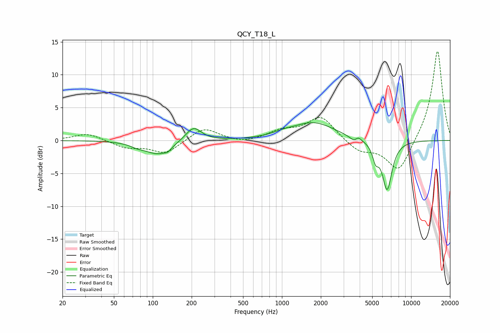

# QCY_T18_L
See [usage instructions](https://github.com/jaakkopasanen/AutoEq#usage) for more options and info.

### Parametric EQs
Apply preamp of -2.8 dB when using parametric equalizer.

|   # | Type    |   Fc (Hz) |    Q |   Gain (dB) |
|-----|---------|-----------|------|-------------|
|   1 | Peaking |        76 | 2.78 |        -0.4 |
|   2 | Peaking |       109 | 1.44 |        -2   |
|   3 | Peaking |       131 | 5.37 |        -0.5 |
|   4 | Peaking |       207 | 2.36 |         2.2 |
|   5 | Peaking |      1020 | 1.71 |         0.4 |
|   6 | Peaking |      1754 | 0.85 |         2.7 |
|   7 | Peaking |      3661 | 4.16 |        -0.8 |
|   8 | Peaking |      3882 | 5.93 |         0.8 |
|   9 | Peaking |      5306 | 5.97 |        -2.2 |
|  10 | Peaking |      6518 | 3.58 |        -7.5 |

### Fixed Band EQs
When using fixed band (also called graphic) equalizer, apply preamp of **-13.6 dB** (if available) and set gains manually with these parameters.

|   # | Type    |   Fc (Hz) |    Q |   Gain (dB) |
|-----|---------|-----------|------|-------------|
|   1 | Peaking |        31 | 1.41 |         1.1 |
|   2 | Peaking |        62 | 1.41 |        -1.1 |
|   3 | Peaking |       125 | 1.41 |        -2   |
|   4 | Peaking |       250 | 1.41 |         2   |
|   5 | Peaking |       500 | 1.41 |        -0.5 |
|   6 | Peaking |      1000 | 1.41 |         1.3 |
|   7 | Peaking |      2000 | 1.41 |         3.6 |
|   8 | Peaking |      4000 | 1.41 |        -1.7 |
|   9 | Peaking |      8000 | 1.41 |        -5   |
|  10 | Peaking |     16000 | 1.41 |        13.9 |

### Graphs

