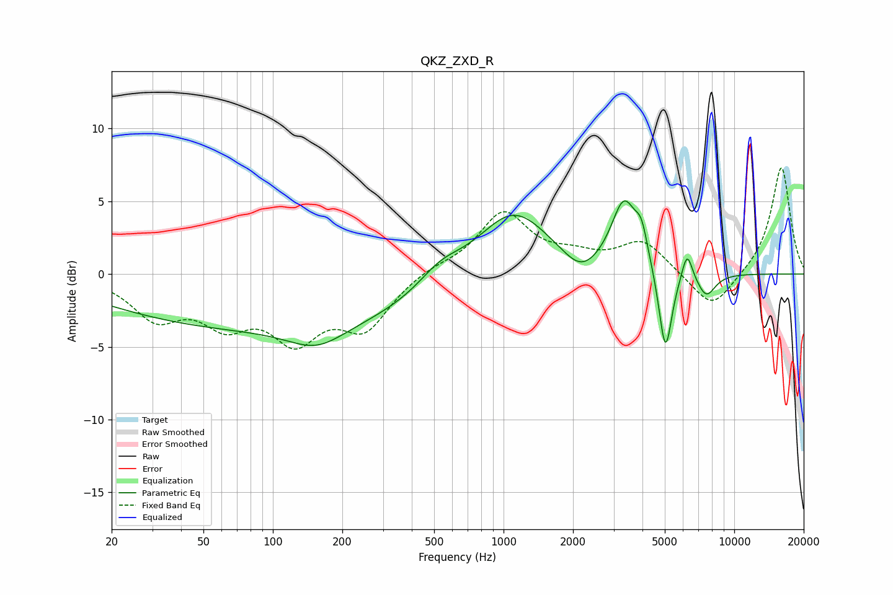

# QKZ_ZXD_R
See [usage instructions](https://github.com/jaakkopasanen/AutoEq#usage) for more options and info.

### Parametric EQs
Apply preamp of -5.1 dB when using parametric equalizer.

|   # | Type    |   Fc (Hz) |    Q |   Gain (dB) |
|-----|---------|-----------|------|-------------|
|   1 | Peaking |        96 | 0.18 |        -3.7 |
|   2 | Peaking |       155 | 1.17 |        -1.4 |
|   3 | Peaking |       532 | 1.45 |         1.4 |
|   4 | Peaking |      1101 | 0.9  |         4.6 |
|   5 | Peaking |      2166 | 1.83 |        -1.4 |
|   6 | Peaking |      3332 | 2.53 |         4.7 |
|   7 | Peaking |      3963 | 5.26 |         1.8 |
|   8 | Peaking |      5031 | 4.87 |        -5.9 |
|   9 | Peaking |      6247 | 6    |         2   |
|  10 | Peaking |      7563 | 3.32 |        -1.6 |

### Fixed Band EQs
When using fixed band (also called graphic) equalizer, apply preamp of **-7.4 dB** (if available) and set gains manually with these parameters.

|   # | Type    |   Fc (Hz) |    Q |   Gain (dB) |
|-----|---------|-----------|------|-------------|
|   1 | Peaking |        31 | 1.41 |        -2.8 |
|   2 | Peaking |        62 | 1.41 |        -2.8 |
|   3 | Peaking |       125 | 1.41 |        -4   |
|   4 | Peaking |       250 | 1.41 |        -3.4 |
|   5 | Peaking |       500 | 1.41 |         0.5 |
|   6 | Peaking |      1000 | 1.41 |         4.1 |
|   7 | Peaking |      2000 | 1.41 |         0.9 |
|   8 | Peaking |      4000 | 1.41 |         2.2 |
|   9 | Peaking |      8000 | 1.41 |        -2.6 |
|  10 | Peaking |     16000 | 1.41 |         7.4 |

### Graphs

