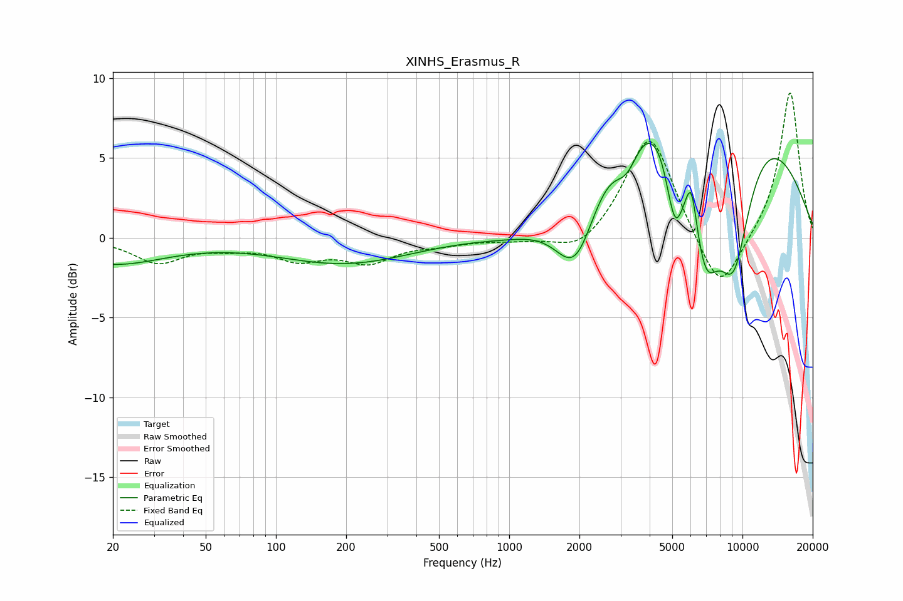

# XINHS_Erasmus_R
See [usage instructions](https://github.com/jaakkopasanen/AutoEq#usage) for more options and info.

### Parametric EQs
Apply preamp of -6.0 dB when using parametric equalizer.

|   # | Type    |   Fc (Hz) |    Q |   Gain (dB) |
|-----|---------|-----------|------|-------------|
|   1 | Peaking |        20 | 0.62 |        -1.6 |
|   2 | Peaking |       199 | 0.48 |        -1.6 |
|   3 | Peaking |      1205 | 0.64 |        -2.6 |
|   4 | Peaking |      1936 | 1.44 |        -6.3 |
|   5 | Peaking |      3189 | 2.48 |        -2.6 |
|   6 | Peaking |      5130 | 3.37 |        -5.3 |
|   7 | Peaking |      5777 | 0.27 |        13.2 |
|   8 | Peaking |      6042 | 6    |         2.4 |
|   9 | Peaking |      6906 | 1.73 |        -9.5 |
|  10 | Peaking |      9172 | 1.51 |        -9.5 |

### Fixed Band EQs
When using fixed band (also called graphic) equalizer, apply preamp of **-9.2 dB** (if available) and set gains manually with these parameters.

|   # | Type    |   Fc (Hz) |    Q |   Gain (dB) |
|-----|---------|-----------|------|-------------|
|   1 | Peaking |        31 | 1.41 |        -1.5 |
|   2 | Peaking |        62 | 1.41 |        -0.4 |
|   3 | Peaking |       125 | 1.41 |        -1.2 |
|   4 | Peaking |       250 | 1.41 |        -1.4 |
|   5 | Peaking |       500 | 1.41 |        -0.3 |
|   6 | Peaking |      1000 | 1.41 |        -0.2 |
|   7 | Peaking |      2000 | 1.41 |        -1.2 |
|   8 | Peaking |      4000 | 1.41 |         6.7 |
|   9 | Peaking |      8000 | 1.41 |        -3.9 |
|  10 | Peaking |     16000 | 1.41 |         9.3 |

### Graphs

