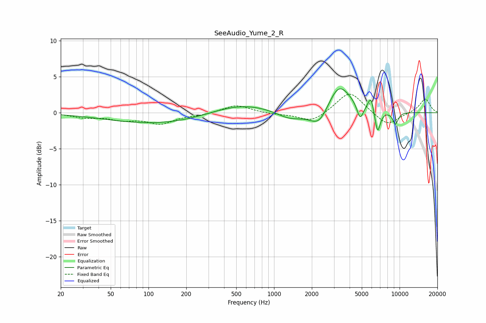

# SeeAudio_Yume_2_R
See [usage instructions](https://github.com/jaakkopasanen/AutoEq#usage) for more options and info.

### Parametric EQs
Apply preamp of -3.4 dB when using parametric equalizer.

|   # | Type    |   Fc (Hz) |    Q |   Gain (dB) |
|-----|---------|-----------|------|-------------|
|   1 | Peaking |       166 | 0.27 |        -1.8 |
|   2 | Peaking |       508 | 0.52 |         2.1 |
|   3 | Peaking |      1339 | 1.25 |        -1.3 |
|   4 | Peaking |      2298 | 1.83 |        -2.8 |
|   5 | Peaking |      3266 | 2.24 |         0.9 |
|   6 | Peaking |      3281 | 1.27 |         3.5 |
|   7 | Peaking |      4847 | 5.5  |        -2.2 |
|   8 | Peaking |      5908 | 5.9  |         2.1 |
|   9 | Peaking |      6671 | 6    |        -3.3 |
|  10 | Peaking |      9269 | 5.74 |        -1.7 |

### Fixed Band EQs
When using fixed band (also called graphic) equalizer, apply preamp of **-2.7 dB** (if available) and set gains manually with these parameters.

|   # | Type    |   Fc (Hz) |    Q |   Gain (dB) |
|-----|---------|-----------|------|-------------|
|   1 | Peaking |        31 | 1.41 |        -0.6 |
|   2 | Peaking |        62 | 1.41 |        -0.8 |
|   3 | Peaking |       125 | 1.41 |        -1.4 |
|   4 | Peaking |       250 | 1.41 |        -0.3 |
|   5 | Peaking |       500 | 1.41 |         1.1 |
|   6 | Peaking |      1000 | 1.41 |        -0.2 |
|   7 | Peaking |      2000 | 1.41 |        -1.3 |
|   8 | Peaking |      4000 | 1.41 |         3.1 |
|   9 | Peaking |      8000 | 1.41 |        -1.9 |
|  10 | Peaking |     16000 | 1.41 |         2   |

### Graphs

