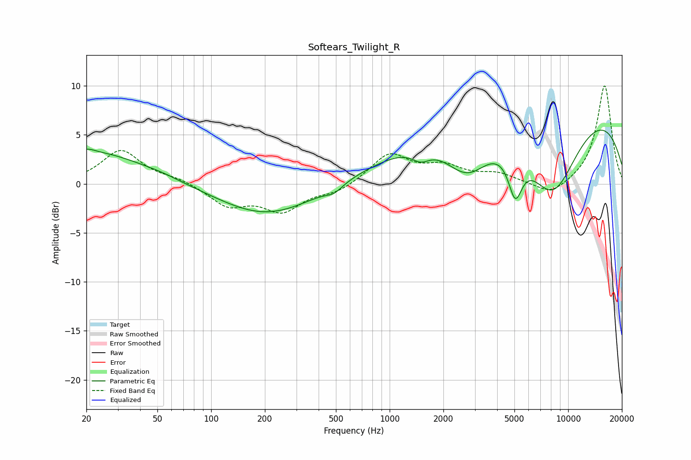

# Softears_Twilight_R
See [usage instructions](https://github.com/jaakkopasanen/AutoEq#usage) for more options and info.

### Parametric EQs
Apply preamp of -5.6 dB when using parametric equalizer.

|   # | Type    |   Fc (Hz) |    Q |   Gain (dB) |
|-----|---------|-----------|------|-------------|
|   1 | Peaking |        20 | 0.42 |         3.4 |
|   2 | Peaking |        21 | 4.37 |         0.3 |
|   3 | Peaking |        53 | 2.02 |         0.1 |
|   4 | Peaking |       206 | 0.52 |        -3.3 |
|   5 | Peaking |       488 | 3.04 |        -0.7 |
|   6 | Peaking |      1491 | 2.78 |        -1.1 |
|   7 | Peaking |      2726 | 0.99 |        -6   |
|   8 | Peaking |      5054 | 3.55 |        -4.4 |
|   9 | Peaking |      6888 | 0.18 |        11.9 |
|  10 | Peaking |      8158 | 0.73 |       -11.5 |

### Fixed Band EQs
When using fixed band (also called graphic) equalizer, apply preamp of **-10.1 dB** (if available) and set gains manually with these parameters.

|   # | Type    |   Fc (Hz) |    Q |   Gain (dB) |
|-----|---------|-----------|------|-------------|
|   1 | Peaking |        31 | 1.41 |         3.4 |
|   2 | Peaking |        62 | 1.41 |         0.5 |
|   3 | Peaking |       125 | 1.41 |        -2.1 |
|   4 | Peaking |       250 | 1.41 |        -2.6 |
|   5 | Peaking |       500 | 1.41 |        -0.8 |
|   6 | Peaking |      1000 | 1.41 |         3   |
|   7 | Peaking |      2000 | 1.41 |         1.6 |
|   8 | Peaking |      4000 | 1.41 |         0.9 |
|   9 | Peaking |      8000 | 1.41 |        -1.3 |
|  10 | Peaking |     16000 | 1.41 |        10.1 |

### Graphs

