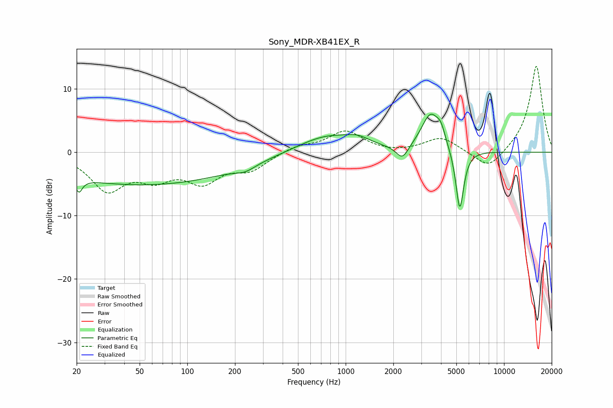

# Sony_MDR-XB41EX_R
See [usage instructions](https://github.com/jaakkopasanen/AutoEq#usage) for more options and info.

### Parametric EQs
Apply preamp of -6.1 dB when using parametric equalizer.

|   # | Type    |   Fc (Hz) |    Q |   Gain (dB) |
|-----|---------|-----------|------|-------------|
|   1 | Peaking |        21 | 5.98 |        -5   |
|   2 | Peaking |        21 | 6    |         2.8 |
|   3 | Peaking |        52 | 0.23 |        -5.1 |
|   4 | Peaking |       232 | 2.21 |        -0.9 |
|   5 | Peaking |       759 | 0.76 |         2.7 |
|   6 | Peaking |      1197 | 1.91 |         1   |
|   7 | Peaking |      2280 | 3.59 |        -2.3 |
|   8 | Peaking |      3441 | 2.37 |         5.9 |
|   9 | Peaking |      3998 | 5.28 |         1.9 |
|  10 | Peaking |      5255 | 5.49 |        -9.9 |

### Fixed Band EQs
When using fixed band (also called graphic) equalizer, apply preamp of **-13.7 dB** (if available) and set gains manually with these parameters.

|   # | Type    |   Fc (Hz) |    Q |   Gain (dB) |
|-----|---------|-----------|------|-------------|
|   1 | Peaking |        31 | 1.41 |        -5.6 |
|   2 | Peaking |        62 | 1.41 |        -3.3 |
|   3 | Peaking |       125 | 1.41 |        -4.1 |
|   4 | Peaking |       250 | 1.41 |        -2.5 |
|   5 | Peaking |       500 | 1.41 |         1   |
|   6 | Peaking |      1000 | 1.41 |         3.3 |
|   7 | Peaking |      2000 | 1.41 |        -0.2 |
|   8 | Peaking |      4000 | 1.41 |         2.3 |
|   9 | Peaking |      8000 | 1.41 |        -3   |
|  10 | Peaking |     16000 | 1.41 |        13.8 |

### Graphs

