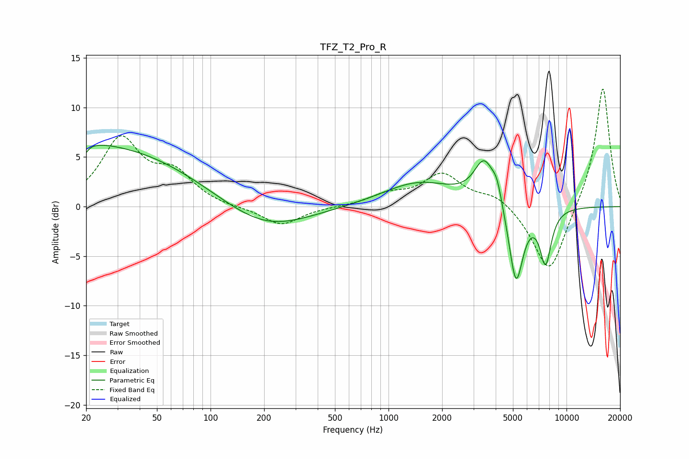

# TFZ_T2_Pro_R
See [usage instructions](https://github.com/jaakkopasanen/AutoEq#usage) for more options and info.

### Parametric EQs
Apply preamp of -6.3 dB when using parametric equalizer.

|   # | Type    |   Fc (Hz) |    Q |   Gain (dB) |
|-----|---------|-----------|------|-------------|
|   1 | Peaking |        20 | 1.03 |         1.2 |
|   2 | Peaking |        20 | 5.95 |        -3.5 |
|   3 | Peaking |        20 | 5.88 |         2.8 |
|   4 | Peaking |        31 | 0.33 |         5.5 |
|   5 | Peaking |       204 | 0.6  |        -2.5 |
|   6 | Peaking |      1479 | 0.7  |         2.4 |
|   7 | Peaking |      3455 | 2.44 |         4.3 |
|   8 | Peaking |      4068 | 5.02 |         1.7 |
|   9 | Peaking |      5201 | 3.41 |        -8.2 |
|  10 | Peaking |      7627 | 4.12 |        -5.4 |

### Fixed Band EQs
When using fixed band (also called graphic) equalizer, apply preamp of **-12.0 dB** (if available) and set gains manually with these parameters.

|   # | Type    |   Fc (Hz) |    Q |   Gain (dB) |
|-----|---------|-----------|------|-------------|
|   1 | Peaking |        31 | 1.41 |         6.6 |
|   2 | Peaking |        62 | 1.41 |         3   |
|   3 | Peaking |       125 | 1.41 |        -0.1 |
|   4 | Peaking |       250 | 1.41 |        -1.9 |
|   5 | Peaking |       500 | 1.41 |        -0   |
|   6 | Peaking |      1000 | 1.41 |         1.1 |
|   7 | Peaking |      2000 | 1.41 |         3.2 |
|   8 | Peaking |      4000 | 1.41 |         1.2 |
|   9 | Peaking |      8000 | 1.41 |        -7   |
|  10 | Peaking |     16000 | 1.41 |        12.3 |

### Graphs

