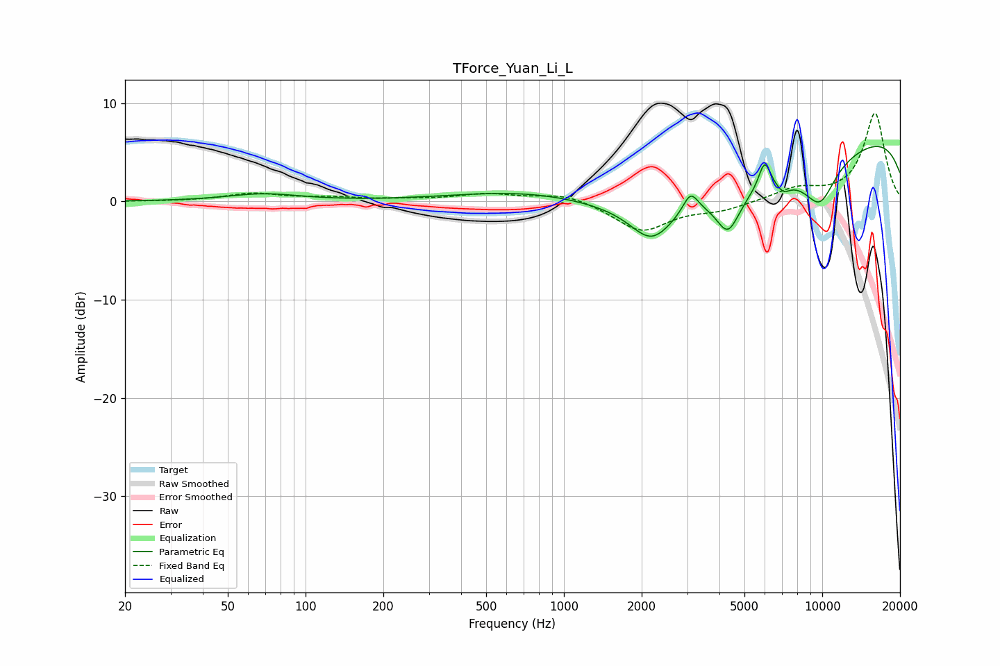

# TForce_Yuan_Li_L
See [usage instructions](https://github.com/jaakkopasanen/AutoEq#usage) for more options and info.

### Parametric EQs
Apply preamp of -5.7 dB when using parametric equalizer.

|   # | Type    |   Fc (Hz) |    Q |   Gain (dB) |
|-----|---------|-----------|------|-------------|
|   1 | Peaking |        69 | 1.01 |         0.8 |
|   2 | Peaking |       863 | 0.48 |         1.8 |
|   3 | Peaking |      2184 | 1.73 |        -3.6 |
|   4 | Peaking |      3093 | 4.77 |         2.1 |
|   5 | Peaking |      4317 | 3.15 |        -3.7 |
|   6 | Peaking |      4702 | 0.25 |        -7.1 |
|   7 | Peaking |      5983 | 5.78 |         3   |
|   8 | Peaking |      7068 | 5.29 |        -0.9 |
|   9 | Peaking |      9778 | 0.18 |         9.5 |
|  10 | Peaking |      9797 | 2.04 |        -3.9 |

### Fixed Band EQs
When using fixed band (also called graphic) equalizer, apply preamp of **-9.1 dB** (if available) and set gains manually with these parameters.

|   # | Type    |   Fc (Hz) |    Q |   Gain (dB) |
|-----|---------|-----------|------|-------------|
|   1 | Peaking |        31 | 1.41 |         0   |
|   2 | Peaking |        62 | 1.41 |         0.8 |
|   3 | Peaking |       125 | 1.41 |         0.3 |
|   4 | Peaking |       250 | 1.41 |         0.2 |
|   5 | Peaking |       500 | 1.41 |         0.7 |
|   6 | Peaking |      1000 | 1.41 |         0.9 |
|   7 | Peaking |      2000 | 1.41 |        -3   |
|   8 | Peaking |      4000 | 1.41 |        -0.8 |
|   9 | Peaking |      8000 | 1.41 |         1.2 |
|  10 | Peaking |     16000 | 1.41 |         9   |

### Graphs

