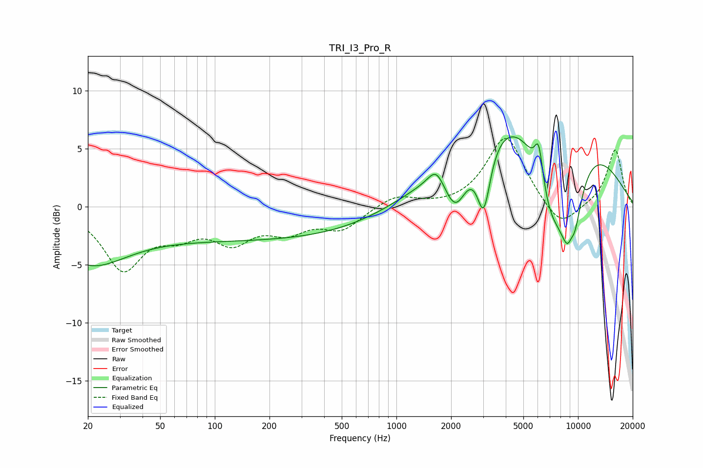

# TRI_I3_Pro_R
See [usage instructions](https://github.com/jaakkopasanen/AutoEq#usage) for more options and info.

### Parametric EQs
Apply preamp of -6.1 dB when using parametric equalizer.

|   # | Type    |   Fc (Hz) |    Q |   Gain (dB) |
|-----|---------|-----------|------|-------------|
|   1 | Peaking |        20 | 0.66 |        -4.3 |
|   2 | Peaking |       179 | 0.18 |        -2.8 |
|   3 | Peaking |      1657 | 3.25 |         1.5 |
|   4 | Peaking |      2117 | 2.14 |        -4.3 |
|   5 | Peaking |      3027 | 3.76 |        -5.7 |
|   6 | Peaking |      5983 | 0.36 |        12   |
|   7 | Peaking |      6080 | 5.93 |         3.2 |
|   8 | Peaking |      7042 | 1.18 |       -10   |
|   9 | Peaking |      9144 | 2.44 |        -9   |
|  10 | Peaking |      9162 | 5.63 |         2.2 |

### Fixed Band EQs
When using fixed band (also called graphic) equalizer, apply preamp of **-6.0 dB** (if available) and set gains manually with these parameters.

|   # | Type    |   Fc (Hz) |    Q |   Gain (dB) |
|-----|---------|-----------|------|-------------|
|   1 | Peaking |        31 | 1.41 |        -5.2 |
|   2 | Peaking |        62 | 1.41 |        -1.8 |
|   3 | Peaking |       125 | 1.41 |        -2.6 |
|   4 | Peaking |       250 | 1.41 |        -1.8 |
|   5 | Peaking |       500 | 1.41 |        -1.8 |
|   6 | Peaking |      1000 | 1.41 |         1   |
|   7 | Peaking |      2000 | 1.41 |        -0.1 |
|   8 | Peaking |      4000 | 1.41 |         6.1 |
|   9 | Peaking |      8000 | 1.41 |        -2.1 |
|  10 | Peaking |     16000 | 1.41 |         5   |

### Graphs

