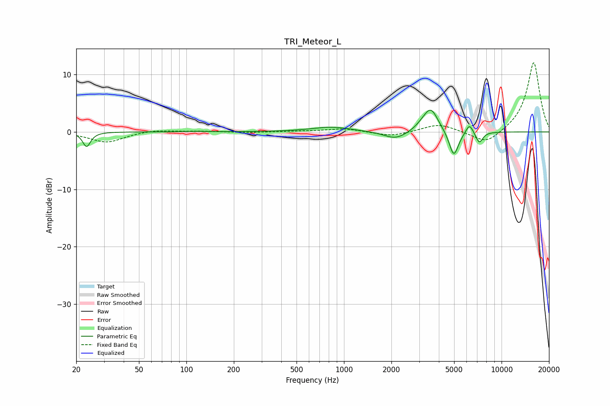

# TRI_Meteor_L
See [usage instructions](https://github.com/jaakkopasanen/AutoEq#usage) for more options and info.

### Parametric EQs
Apply preamp of -3.9 dB when using parametric equalizer.

|   # | Type    |   Fc (Hz) |    Q |   Gain (dB) |
|-----|---------|-----------|------|-------------|
|   1 | Peaking |        23 | 5.84 |        -2.5 |
|   2 | Peaking |       113 | 1.85 |         0.1 |
|   3 | Peaking |       835 | 1.1  |         0.9 |
|   4 | Peaking |      2112 | 2.07 |        -1.1 |
|   5 | Peaking |      2304 | 1.34 |        -0.4 |
|   6 | Peaking |      3240 | 2.44 |         1   |
|   7 | Peaking |      3571 | 3.09 |         3.6 |
|   8 | Peaking |      4977 | 4.7  |        -4.5 |
|   9 | Peaking |      6259 | 6    |         1.8 |
|  10 | Peaking |      7222 | 6    |        -2   |

### Fixed Band EQs
When using fixed band (also called graphic) equalizer, apply preamp of **-12.1 dB** (if available) and set gains manually with these parameters.

|   # | Type    |   Fc (Hz) |    Q |   Gain (dB) |
|-----|---------|-----------|------|-------------|
|   1 | Peaking |        31 | 1.41 |        -1.8 |
|   2 | Peaking |        62 | 1.41 |         0.4 |
|   3 | Peaking |       125 | 1.41 |         0.1 |
|   4 | Peaking |       250 | 1.41 |        -0.1 |
|   5 | Peaking |       500 | 1.41 |         0.1 |
|   6 | Peaking |      1000 | 1.41 |         0.6 |
|   7 | Peaking |      2000 | 1.41 |        -0.8 |
|   8 | Peaking |      4000 | 1.41 |         1.4 |
|   9 | Peaking |      8000 | 1.41 |        -2.3 |
|  10 | Peaking |     16000 | 1.41 |        12.2 |

### Graphs

