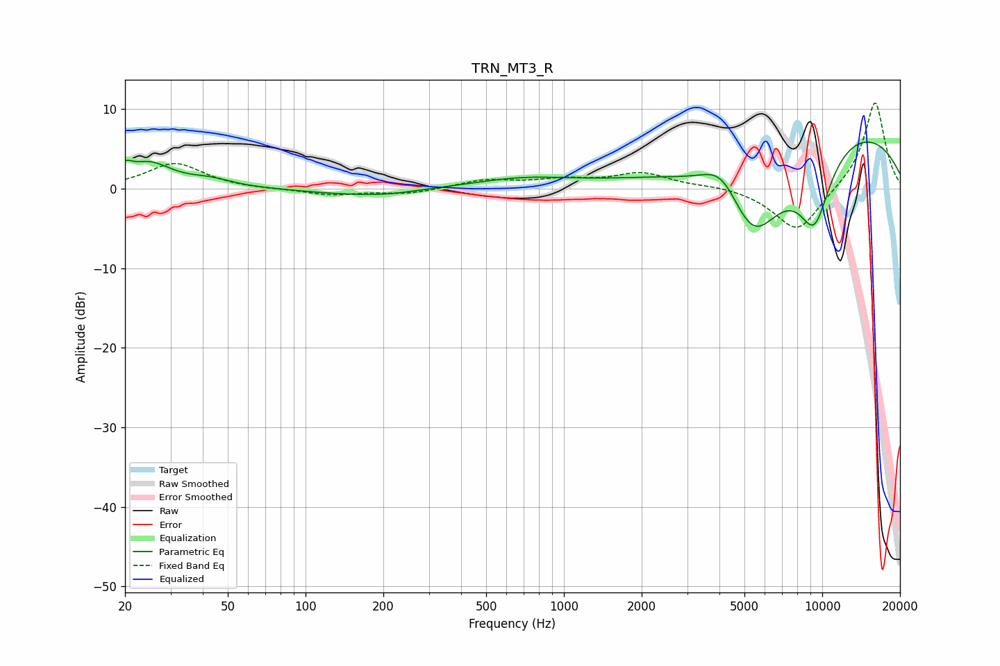

# TRN_MT3_R
See [usage instructions](https://github.com/jaakkopasanen/AutoEq#usage) for more options and info.

### Parametric EQs
Apply preamp of -5.9 dB when using parametric equalizer.

|   # | Type    |   Fc (Hz) |    Q |   Gain (dB) |
|-----|---------|-----------|------|-------------|
|   1 | Peaking |        20 | 5.48 |         1.3 |
|   2 | Peaking |        25 | 1.6  |         3   |
|   3 | Peaking |        43 | 1.66 |         0.9 |
|   4 | Peaking |       148 | 0.75 |        -0.6 |
|   5 | Peaking |       211 | 1.25 |        -0.4 |
|   6 | Peaking |       697 | 0.76 |         1.2 |
|   7 | Peaking |      4078 | 1.81 |         4   |
|   8 | Peaking |      5400 | 1.04 |       -12.5 |
|   9 | Peaking |      9323 | 1.88 |        -9.2 |
|  10 | Peaking |     10000 | 0.25 |         8.8 |

### Fixed Band EQs
When using fixed band (also called graphic) equalizer, apply preamp of **-10.8 dB** (if available) and set gains manually with these parameters.

|   # | Type    |   Fc (Hz) |    Q |   Gain (dB) |
|-----|---------|-----------|------|-------------|
|   1 | Peaking |        31 | 1.41 |         3.2 |
|   2 | Peaking |        62 | 1.41 |        -0.1 |
|   3 | Peaking |       125 | 1.41 |        -0.8 |
|   4 | Peaking |       250 | 1.41 |        -0.7 |
|   5 | Peaking |       500 | 1.41 |         1   |
|   6 | Peaking |      1000 | 1.41 |         1   |
|   7 | Peaking |      2000 | 1.41 |         1.9 |
|   8 | Peaking |      4000 | 1.41 |         0.4 |
|   9 | Peaking |      8000 | 1.41 |        -5.6 |
|  10 | Peaking |     16000 | 1.41 |        11.1 |

### Graphs

