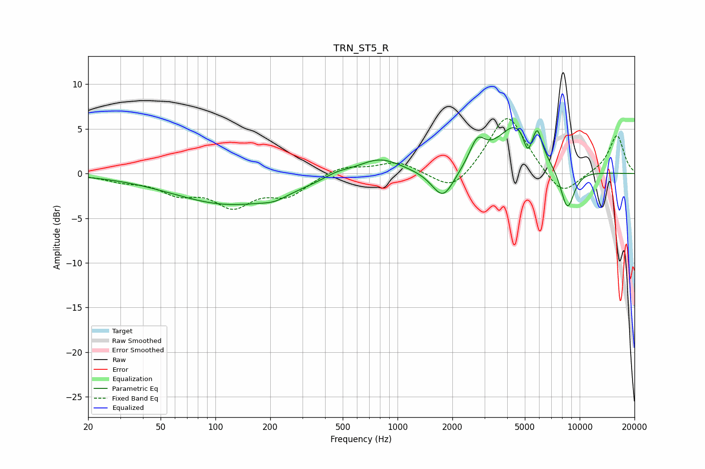

# TRN_ST5_R
See [usage instructions](https://github.com/jaakkopasanen/AutoEq#usage) for more options and info.

### Parametric EQs
Apply preamp of -5.2 dB when using parametric equalizer.

|   # | Type    |   Fc (Hz) |    Q |   Gain (dB) |
|-----|---------|-----------|------|-------------|
|   1 | Peaking |       122 | 0.44 |        -3.4 |
|   2 | Peaking |       211 | 2.15 |        -0.5 |
|   3 | Peaking |       464 | 1.88 |         0.6 |
|   4 | Peaking |       795 | 1.19 |         1.9 |
|   5 | Peaking |      1778 | 2.31 |        -3.3 |
|   6 | Peaking |      2743 | 3.32 |         2.7 |
|   7 | Peaking |      4525 | 1.28 |         5.5 |
|   8 | Peaking |      5178 | 5.95 |        -2.3 |
|   9 | Peaking |      5863 | 6    |         2.4 |
|  10 | Peaking |      8555 | 3.24 |        -4.7 |

### Fixed Band EQs
When using fixed band (also called graphic) equalizer, apply preamp of **-6.2 dB** (if available) and set gains manually with these parameters.

|   # | Type    |   Fc (Hz) |    Q |   Gain (dB) |
|-----|---------|-----------|------|-------------|
|   1 | Peaking |        31 | 1.41 |        -0.7 |
|   2 | Peaking |        62 | 1.41 |        -1.9 |
|   3 | Peaking |       125 | 1.41 |        -3.3 |
|   4 | Peaking |       250 | 1.41 |        -2.2 |
|   5 | Peaking |       500 | 1.41 |         0.9 |
|   6 | Peaking |      1000 | 1.41 |         1.3 |
|   7 | Peaking |      2000 | 1.41 |        -2.4 |
|   8 | Peaking |      4000 | 1.41 |         6.9 |
|   9 | Peaking |      8000 | 1.41 |        -2.8 |
|  10 | Peaking |     16000 | 1.41 |         4.3 |

### Graphs

