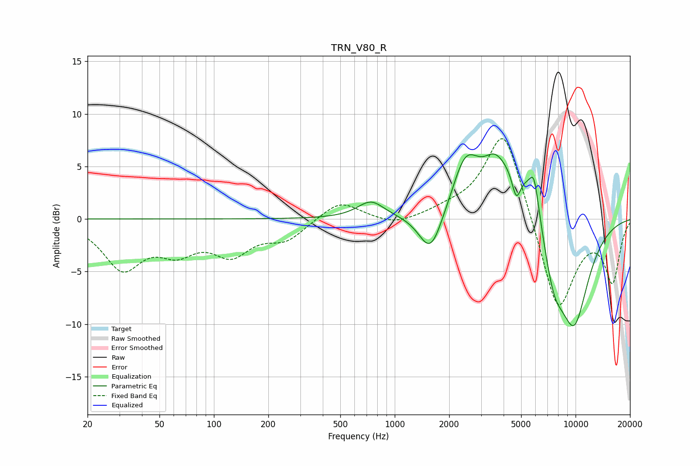

# TRN_V80_R
See [usage instructions](https://github.com/jaakkopasanen/AutoEq#usage) for more options and info.

### Parametric EQs
Apply preamp of -6.3 dB when using parametric equalizer.

|   # | Type    |   Fc (Hz) |    Q |   Gain (dB) |
|-----|---------|-----------|------|-------------|
|   1 | Peaking |       738 | 1.93 |         1.6 |
|   2 | Peaking |      1577 | 2.2  |        -4   |
|   3 | Peaking |      1853 | 1.41 |        -0.6 |
|   4 | Peaking |      2456 | 1.89 |         4.7 |
|   5 | Peaking |      3555 | 2.52 |         1.8 |
|   6 | Peaking |      4705 | 5.52 |        -2.9 |
|   7 | Peaking |      5200 | 0.78 |         6.7 |
|   8 | Peaking |      5899 | 5.63 |         2.8 |
|   9 | Peaking |      7522 | 1.92 |        -6.3 |
|  10 | Peaking |      9812 | 1.34 |       -10.4 |

### Fixed Band EQs
When using fixed band (also called graphic) equalizer, apply preamp of **-7.7 dB** (if available) and set gains manually with these parameters.

|   # | Type    |   Fc (Hz) |    Q |   Gain (dB) |
|-----|---------|-----------|------|-------------|
|   1 | Peaking |        31 | 1.41 |        -4.5 |
|   2 | Peaking |        62 | 1.41 |        -2.5 |
|   3 | Peaking |       125 | 1.41 |        -3   |
|   4 | Peaking |       250 | 1.41 |        -1.8 |
|   5 | Peaking |       500 | 1.41 |         1.8 |
|   6 | Peaking |      1000 | 1.41 |        -0.7 |
|   7 | Peaking |      2000 | 1.41 |         0.6 |
|   8 | Peaking |      4000 | 1.41 |         9   |
|   9 | Peaking |      8000 | 1.41 |        -9.3 |
|  10 | Peaking |     16000 | 1.41 |        -5.7 |

### Graphs

