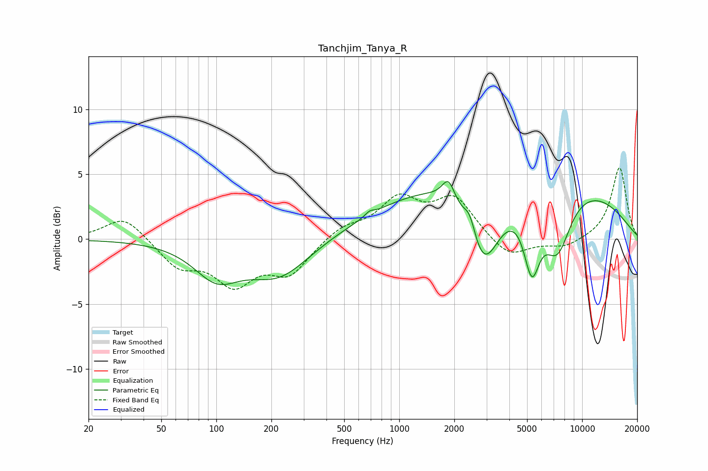

# Tanchjim_Tanya_R
See [usage instructions](https://github.com/jaakkopasanen/AutoEq#usage) for more options and info.

### Parametric EQs
Apply preamp of -4.5 dB when using parametric equalizer.

|   # | Type    |   Fc (Hz) |    Q |   Gain (dB) |
|-----|---------|-----------|------|-------------|
|   1 | Peaking |       100 | 1.15 |        -2.6 |
|   2 | Peaking |       220 | 0.83 |        -2.8 |
|   3 | Peaking |       689 | 5.99 |         0.3 |
|   4 | Peaking |      1858 | 4.13 |         1.7 |
|   5 | Peaking |      2432 | 4.34 |         1.6 |
|   6 | Peaking |      2463 | 1.08 |         0.3 |
|   7 | Peaking |      2879 | 1.48 |        -6.6 |
|   8 | Peaking |      4099 | 0.18 |         5.5 |
|   9 | Peaking |      5306 | 3.08 |        -5.1 |
|  10 | Peaking |      7291 | 1.71 |        -5   |

### Fixed Band EQs
When using fixed band (also called graphic) equalizer, apply preamp of **-5.6 dB** (if available) and set gains manually with these parameters.

|   # | Type    |   Fc (Hz) |    Q |   Gain (dB) |
|-----|---------|-----------|------|-------------|
|   1 | Peaking |        31 | 1.41 |         1.8 |
|   2 | Peaking |        62 | 1.41 |        -2   |
|   3 | Peaking |       125 | 1.41 |        -3.2 |
|   4 | Peaking |       250 | 1.41 |        -2.5 |
|   5 | Peaking |       500 | 1.41 |         0.9 |
|   6 | Peaking |      1000 | 1.41 |         2.9 |
|   7 | Peaking |      2000 | 1.41 |         3   |
|   8 | Peaking |      4000 | 1.41 |        -1.5 |
|   9 | Peaking |      8000 | 1.41 |        -0.7 |
|  10 | Peaking |     16000 | 1.41 |         5.6 |

### Graphs

