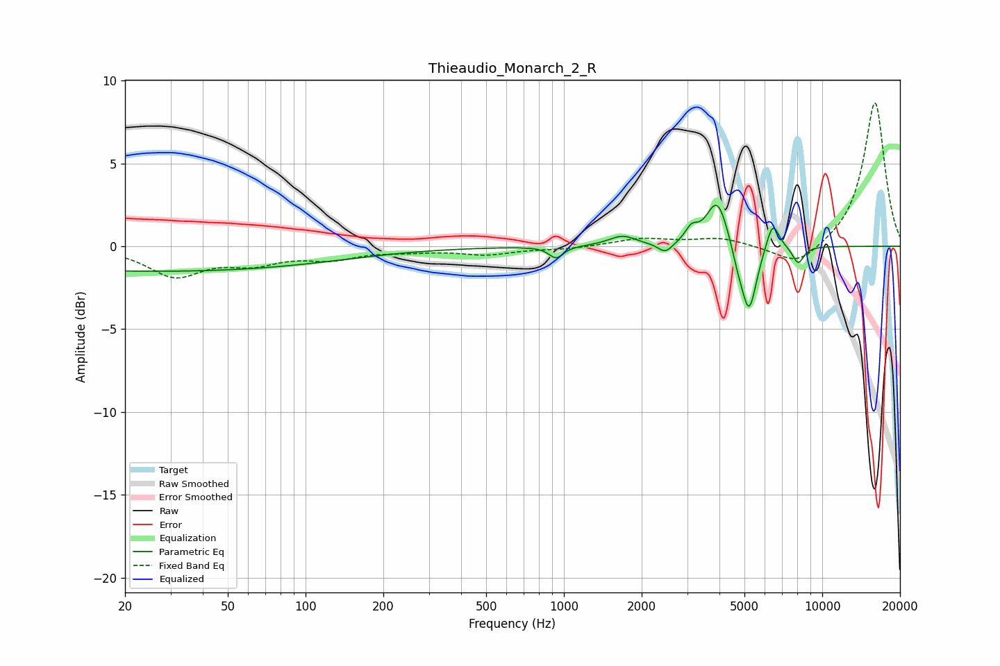

# Thieaudio_Monarch_2_R
See [usage instructions](https://github.com/jaakkopasanen/AutoEq#usage) for more options and info.

### Parametric EQs
Apply preamp of -2.6 dB when using parametric equalizer.

|   # | Type    |   Fc (Hz) |    Q |   Gain (dB) |
|-----|---------|-----------|------|-------------|
|   1 | Peaking |        26 | 0.18 |        -1.5 |
|   2 | Peaking |       933 | 5.21 |        -0.7 |
|   3 | Peaking |      1684 | 2.69 |         0.6 |
|   4 | Peaking |      2470 | 5.03 |        -0.6 |
|   5 | Peaking |      3119 | 5.9  |         0.8 |
|   6 | Peaking |      3923 | 3.35 |         2.9 |
|   7 | Peaking |      4707 | 5.98 |        -0.8 |
|   8 | Peaking |      5207 | 4.67 |        -4.1 |
|   9 | Peaking |      6434 | 5.52 |         1.7 |
|  10 | Peaking |      8068 | 6    |        -1.1 |

### Fixed Band EQs
When using fixed band (also called graphic) equalizer, apply preamp of **-8.7 dB** (if available) and set gains manually with these parameters.

|   # | Type    |   Fc (Hz) |    Q |   Gain (dB) |
|-----|---------|-----------|------|-------------|
|   1 | Peaking |        31 | 1.41 |        -1.7 |
|   2 | Peaking |        62 | 1.41 |        -0.9 |
|   3 | Peaking |       125 | 1.41 |        -0.6 |
|   4 | Peaking |       250 | 1.41 |        -0.2 |
|   5 | Peaking |       500 | 1.41 |        -0.5 |
|   6 | Peaking |      1000 | 1.41 |        -0.1 |
|   7 | Peaking |      2000 | 1.41 |         0.5 |
|   8 | Peaking |      4000 | 1.41 |         0.5 |
|   9 | Peaking |      8000 | 1.41 |        -1.3 |
|  10 | Peaking |     16000 | 1.41 |         8.8 |

### Graphs

