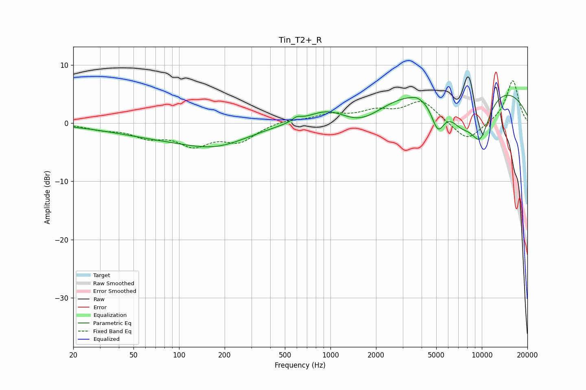

# Tin_T2+_R
See [usage instructions](https://github.com/jaakkopasanen/AutoEq#usage) for more options and info.

### Parametric EQs
Apply preamp of -4.9 dB when using parametric equalizer.

|   # | Type    |   Fc (Hz) |    Q |   Gain (dB) |
|-----|---------|-----------|------|-------------|
|   1 | Peaking |        75 | 0.42 |        -1.9 |
|   2 | Peaking |       180 | 0.65 |        -2.9 |
|   3 | Peaking |       599 | 5.01 |         0.7 |
|   4 | Peaking |       959 | 1.12 |         1.9 |
|   5 | Peaking |      1594 | 0.93 |        -3.4 |
|   6 | Peaking |      3697 | 5.14 |         0.2 |
|   7 | Peaking |      5129 | 3.04 |        -5.4 |
|   8 | Peaking |      7266 | 1.52 |        -4.8 |
|   9 | Peaking |      7594 | 0.2  |         7.8 |
|  10 | Peaking |      9723 | 1.72 |        -8   |

### Fixed Band EQs
When using fixed band (also called graphic) equalizer, apply preamp of **-7.4 dB** (if available) and set gains manually with these parameters.

|   # | Type    |   Fc (Hz) |    Q |   Gain (dB) |
|-----|---------|-----------|------|-------------|
|   1 | Peaking |        31 | 1.41 |        -0.9 |
|   2 | Peaking |        62 | 1.41 |        -2   |
|   3 | Peaking |       125 | 1.41 |        -3.4 |
|   4 | Peaking |       250 | 1.41 |        -2.9 |
|   5 | Peaking |       500 | 1.41 |         0.6 |
|   6 | Peaking |      1000 | 1.41 |         1.4 |
|   7 | Peaking |      2000 | 1.41 |         1.8 |
|   8 | Peaking |      4000 | 1.41 |         3.7 |
|   9 | Peaking |      8000 | 1.41 |        -3.3 |
|  10 | Peaking |     16000 | 1.41 |         7.5 |

### Graphs

