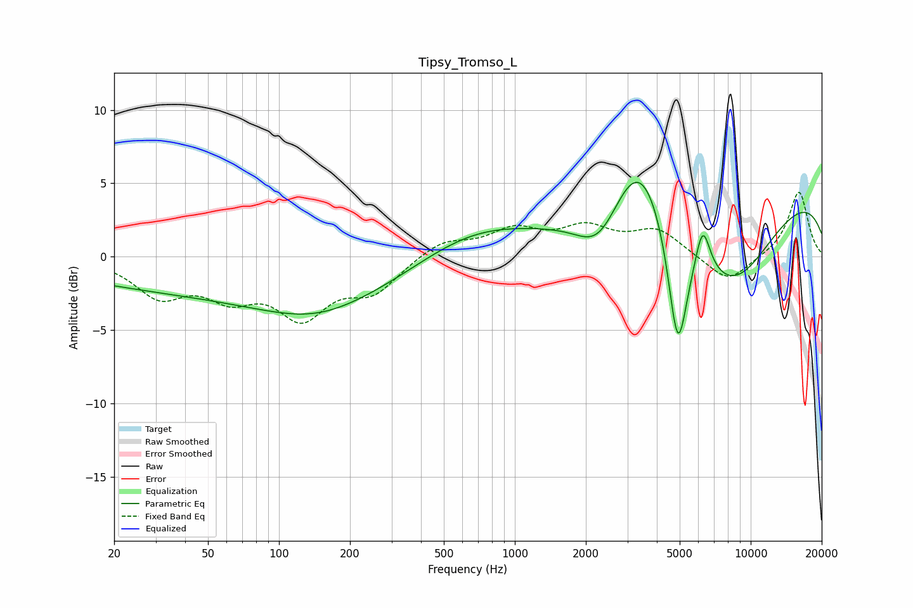

# Tipsy_Tromso_L
See [usage instructions](https://github.com/jaakkopasanen/AutoEq#usage) for more options and info.

### Parametric EQs
Apply preamp of -5.2 dB when using parametric equalizer.

|   # | Type    |   Fc (Hz) |    Q |   Gain (dB) |
|-----|---------|-----------|------|-------------|
|   1 | Peaking |        45 | 0.24 |        -2.2 |
|   2 | Peaking |       142 | 0.85 |        -0.5 |
|   3 | Peaking |       185 | 0.42 |        -2.3 |
|   4 | Peaking |       676 | 0.56 |         2   |
|   5 | Peaking |      2278 | 1.46 |        -3.1 |
|   6 | Peaking |      3366 | 1.16 |         5.5 |
|   7 | Peaking |      4909 | 3.27 |        -8.8 |
|   8 | Peaking |      6262 | 4.46 |         3.1 |
|   9 | Peaking |      8181 | 0.67 |        -6.6 |
|  10 | Peaking |     10000 | 0.18 |         5   |

### Fixed Band EQs
When using fixed band (also called graphic) equalizer, apply preamp of **-4.5 dB** (if available) and set gains manually with these parameters.

|   # | Type    |   Fc (Hz) |    Q |   Gain (dB) |
|-----|---------|-----------|------|-------------|
|   1 | Peaking |        31 | 1.41 |        -2.5 |
|   2 | Peaking |        62 | 1.41 |        -2.3 |
|   3 | Peaking |       125 | 1.41 |        -3.7 |
|   4 | Peaking |       250 | 1.41 |        -2.2 |
|   5 | Peaking |       500 | 1.41 |         1.1 |
|   6 | Peaking |      1000 | 1.41 |         1.7 |
|   7 | Peaking |      2000 | 1.41 |         1.7 |
|   8 | Peaking |      4000 | 1.41 |         1.7 |
|   9 | Peaking |      8000 | 1.41 |        -1.9 |
|  10 | Peaking |     16000 | 1.41 |         4.5 |

### Graphs

