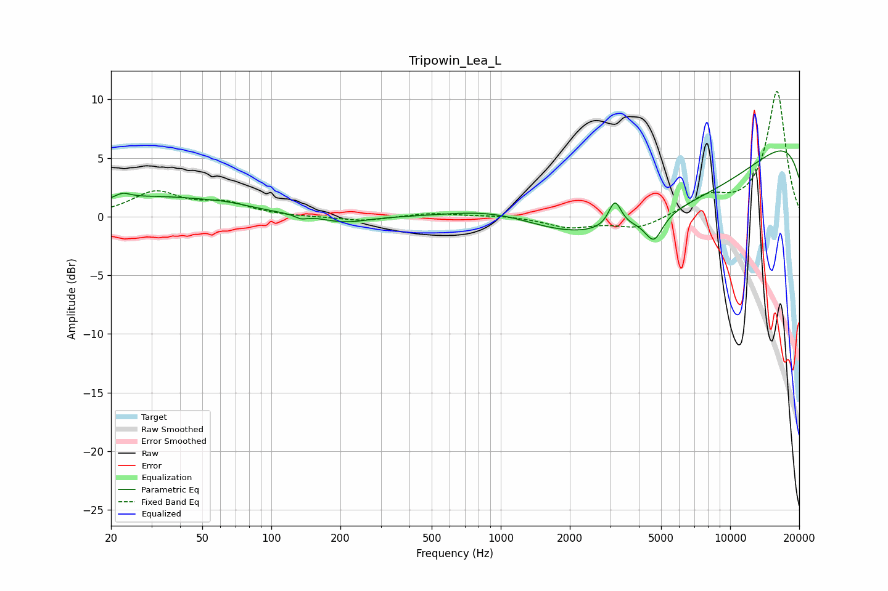

# Tripowin_Lea_L
See [usage instructions](https://github.com/jaakkopasanen/AutoEq#usage) for more options and info.

### Parametric EQs
Apply preamp of -5.7 dB when using parametric equalizer.

|   # | Type    |   Fc (Hz) |    Q |   Gain (dB) |
|-----|---------|-----------|------|-------------|
|   1 | Peaking |        22 | 3.99 |         0.5 |
|   2 | Peaking |        31 | 0.53 |         1.6 |
|   3 | Peaking |        64 | 1.2  |         0.4 |
|   4 | Peaking |       135 | 5.52 |        -0.3 |
|   5 | Peaking |       208 | 1.43 |        -0.6 |
|   6 | Peaking |      1004 | 0.59 |         2.7 |
|   7 | Peaking |      3146 | 5.13 |         2.3 |
|   8 | Peaking |      4655 | 3.7  |        -2.1 |
|   9 | Peaking |      4720 | 0.21 |        -9.4 |
|  10 | Peaking |     10000 | 0.18 |        10.8 |

### Fixed Band EQs
When using fixed band (also called graphic) equalizer, apply preamp of **-10.8 dB** (if available) and set gains manually with these parameters.

|   # | Type    |   Fc (Hz) |    Q |   Gain (dB) |
|-----|---------|-----------|------|-------------|
|   1 | Peaking |        31 | 1.41 |         2   |
|   2 | Peaking |        62 | 1.41 |         1   |
|   3 | Peaking |       125 | 1.41 |        -0   |
|   4 | Peaking |       250 | 1.41 |        -0.4 |
|   5 | Peaking |       500 | 1.41 |         0.3 |
|   6 | Peaking |      1000 | 1.41 |         0.1 |
|   7 | Peaking |      2000 | 1.41 |        -0.9 |
|   8 | Peaking |      4000 | 1.41 |        -1   |
|   9 | Peaking |      8000 | 1.41 |         1.5 |
|  10 | Peaking |     16000 | 1.41 |        10.7 |

### Graphs

