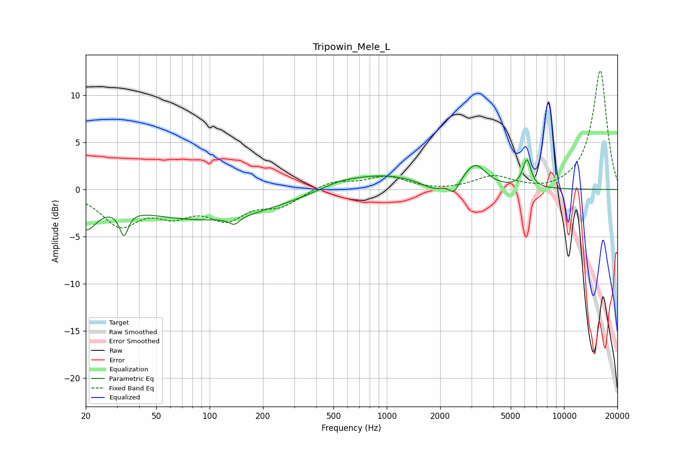

# Tripowin_Mele_L
See [usage instructions](https://github.com/jaakkopasanen/AutoEq#usage) for more options and info.

### Parametric EQs
Apply preamp of -3.2 dB when using parametric equalizer.

|   # | Type    |   Fc (Hz) |    Q |   Gain (dB) |
|-----|---------|-----------|------|-------------|
|   1 | Peaking |        20 | 2.29 |        -3.3 |
|   2 | Peaking |        33 | 5.91 |        -2.6 |
|   3 | Peaking |        95 | 0.35 |        -3.2 |
|   4 | Peaking |       138 | 4.74 |        -0.8 |
|   5 | Peaking |       536 | 1.29 |         0.6 |
|   6 | Peaking |       947 | 0.69 |         1.5 |
|   7 | Peaking |      1845 | 2.18 |        -0.8 |
|   8 | Peaking |      2392 | 5.41 |        -1.2 |
|   9 | Peaking |      3151 | 2.32 |         2.5 |
|  10 | Peaking |      6170 | 6    |         2.9 |

### Fixed Band EQs
When using fixed band (also called graphic) equalizer, apply preamp of **-12.7 dB** (if available) and set gains manually with these parameters.

|   # | Type    |   Fc (Hz) |    Q |   Gain (dB) |
|-----|---------|-----------|------|-------------|
|   1 | Peaking |        31 | 1.41 |        -3.6 |
|   2 | Peaking |        62 | 1.41 |        -2.1 |
|   3 | Peaking |       125 | 1.41 |        -2.7 |
|   4 | Peaking |       250 | 1.41 |        -1.5 |
|   5 | Peaking |       500 | 1.41 |         0.9 |
|   6 | Peaking |      1000 | 1.41 |         1.3 |
|   7 | Peaking |      2000 | 1.41 |        -0.2 |
|   8 | Peaking |      4000 | 1.41 |         1.3 |
|   9 | Peaking |      8000 | 1.41 |        -0.3 |
|  10 | Peaking |     16000 | 1.41 |        12.7 |

### Graphs

