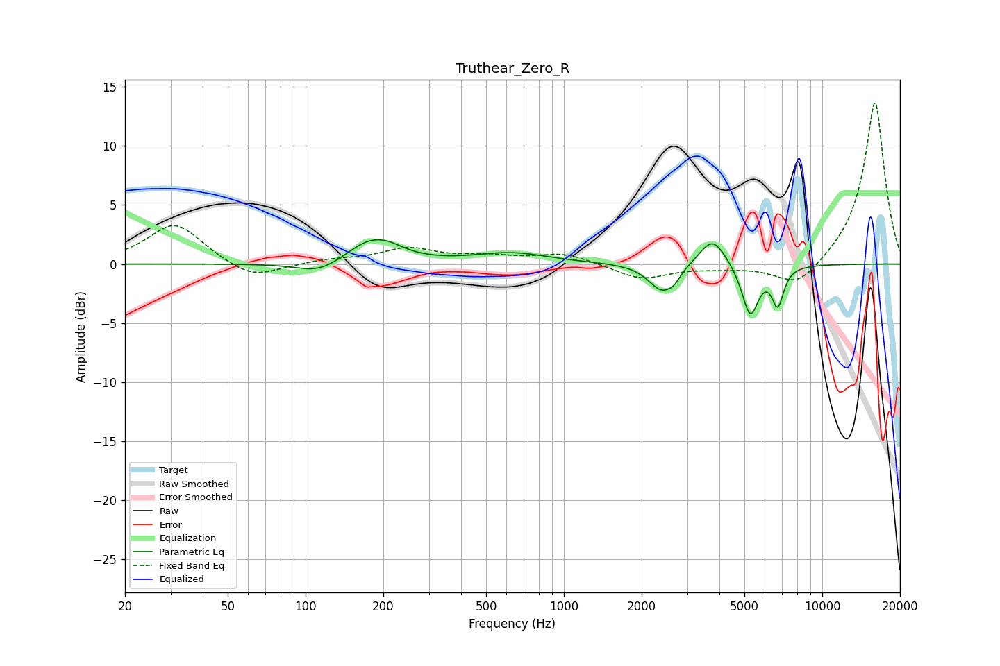

# Truthear_Zero_R
See [usage instructions](https://github.com/jaakkopasanen/AutoEq#usage) for more options and info.

### Parametric EQs
Apply preamp of -2.2 dB when using parametric equalizer.

|   # | Type    |   Fc (Hz) |    Q |   Gain (dB) |
|-----|---------|-----------|------|-------------|
|   1 | Peaking |       108 | 2.35 |        -0.2 |
|   2 | Peaking |       118 | 1.41 |        -0.9 |
|   3 | Peaking |       176 | 1.47 |         2   |
|   4 | Peaking |       211 | 2.34 |         0.4 |
|   5 | Peaking |       629 | 0.99 |         0.9 |
|   6 | Peaking |      2391 | 2.76 |        -2.3 |
|   7 | Peaking |      2671 | 5.74 |        -0.6 |
|   8 | Peaking |      3763 | 2.76 |         2.5 |
|   9 | Peaking |      5266 | 4.3  |        -4.4 |
|  10 | Peaking |      6728 | 6    |        -3.2 |

### Fixed Band EQs
When using fixed band (also called graphic) equalizer, apply preamp of **-13.8 dB** (if available) and set gains manually with these parameters.

|   # | Type    |   Fc (Hz) |    Q |   Gain (dB) |
|-----|---------|-----------|------|-------------|
|   1 | Peaking |        31 | 1.41 |         3.5 |
|   2 | Peaking |        62 | 1.41 |        -1.4 |
|   3 | Peaking |       125 | 1.41 |         0.3 |
|   4 | Peaking |       250 | 1.41 |         1.2 |
|   5 | Peaking |       500 | 1.41 |         0.5 |
|   6 | Peaking |      1000 | 1.41 |         0.9 |
|   7 | Peaking |      2000 | 1.41 |        -1.3 |
|   8 | Peaking |      4000 | 1.41 |        -0.3 |
|   9 | Peaking |      8000 | 1.41 |        -2.2 |
|  10 | Peaking |     16000 | 1.41 |        13.9 |

### Graphs

