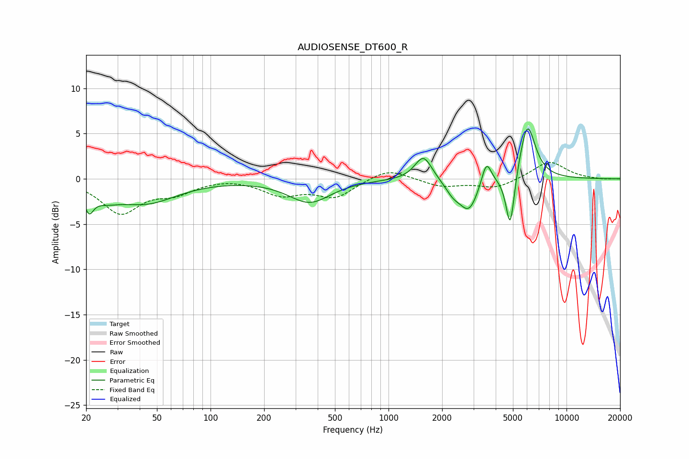

# AUDIOSENSE_DT600_R
See [usage instructions](https://github.com/jaakkopasanen/AutoEq#usage) for more options and info.

### Parametric EQs
Apply preamp of -5.6 dB when using parametric equalizer.

|   # | Type    |   Fc (Hz) |    Q |   Gain (dB) |
|-----|---------|-----------|------|-------------|
|   1 | Peaking |        21 | 5.72 |        -2.1 |
|   2 | Peaking |        25 | 1.7  |        -1.2 |
|   3 | Peaking |        43 | 0.8  |        -2.5 |
|   4 | Peaking |       360 | 1.19 |        -2.6 |
|   5 | Peaking |      1570 | 2.94 |         2.7 |
|   6 | Peaking |      2307 | 3.16 |        -1.3 |
|   7 | Peaking |      2833 | 2.69 |        -3.4 |
|   8 | Peaking |      3547 | 5.14 |         2.7 |
|   9 | Peaking |      4827 | 5.73 |        -6.4 |
|  10 | Peaking |      6026 | 3.08 |         6.3 |

### Fixed Band EQs
When using fixed band (also called graphic) equalizer, apply preamp of **-1.9 dB** (if available) and set gains manually with these parameters.

|   # | Type    |   Fc (Hz) |    Q |   Gain (dB) |
|-----|---------|-----------|------|-------------|
|   1 | Peaking |        31 | 1.41 |        -3.7 |
|   2 | Peaking |        62 | 1.41 |        -1.4 |
|   3 | Peaking |       125 | 1.41 |         0.2 |
|   4 | Peaking |       250 | 1.41 |        -1.6 |
|   5 | Peaking |       500 | 1.41 |        -1.9 |
|   6 | Peaking |      1000 | 1.41 |         1.2 |
|   7 | Peaking |      2000 | 1.41 |        -0.8 |
|   8 | Peaking |      4000 | 1.41 |        -1   |
|   9 | Peaking |      8000 | 1.41 |         2   |
|  10 | Peaking |     16000 | 1.41 |        -0.1 |

### Graphs

