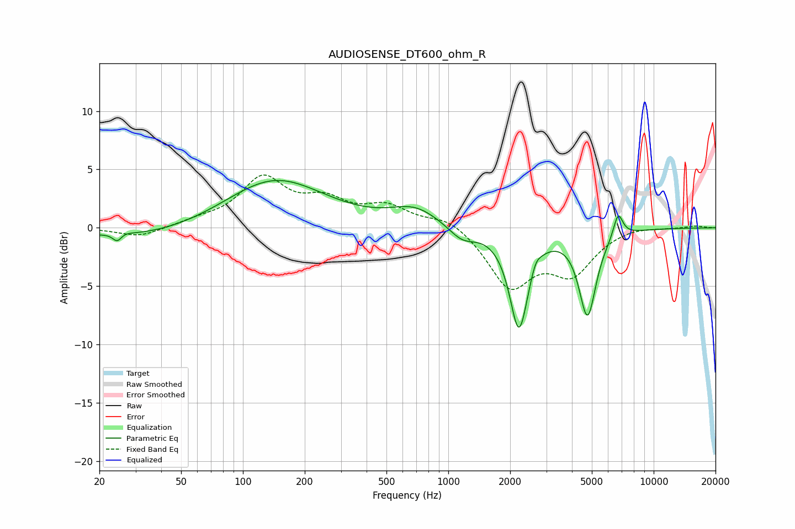

# AUDIOSENSE_DT600_ohm_R
See [usage instructions](https://github.com/jaakkopasanen/AutoEq#usage) for more options and info.

### Parametric EQs
Apply preamp of -4.2 dB when using parametric equalizer.

|   # | Type    |   Fc (Hz) |    Q |   Gain (dB) |
|-----|---------|-----------|------|-------------|
|   1 | Peaking |        24 | 5.92 |        -1.1 |
|   2 | Peaking |        25 | 3.84 |         0.6 |
|   3 | Peaking |        33 | 0.4  |        -1   |
|   4 | Peaking |       142 | 0.58 |         4.3 |
|   5 | Peaking |       689 | 1.21 |         1.5 |
|   6 | Peaking |      1168 | 2.16 |        -1.2 |
|   7 | Peaking |      2208 | 3.09 |        -8.5 |
|   8 | Peaking |      2662 | 5.98 |         0.8 |
|   9 | Peaking |      4762 | 3.34 |        -7.3 |
|  10 | Peaking |      6715 | 5.92 |         2.1 |

### Fixed Band EQs
When using fixed band (also called graphic) equalizer, apply preamp of **-4.6 dB** (if available) and set gains manually with these parameters.

|   # | Type    |   Fc (Hz) |    Q |   Gain (dB) |
|-----|---------|-----------|------|-------------|
|   1 | Peaking |        31 | 1.41 |        -0.8 |
|   2 | Peaking |        62 | 1.41 |         0.5 |
|   3 | Peaking |       125 | 1.41 |         4   |
|   4 | Peaking |       250 | 1.41 |         2   |
|   5 | Peaking |       500 | 1.41 |         1.7 |
|   6 | Peaking |      1000 | 1.41 |         1   |
|   7 | Peaking |      2000 | 1.41 |        -4.9 |
|   8 | Peaking |      4000 | 1.41 |        -3.6 |
|   9 | Peaking |      8000 | 1.41 |         0.3 |
|  10 | Peaking |     16000 | 1.41 |         0.2 |

### Graphs

