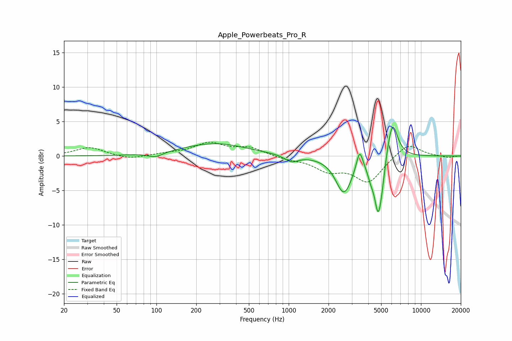

# Apple_Powerbeats_Pro_R
See [usage instructions](https://github.com/jaakkopasanen/AutoEq#usage) for more options and info.

### Parametric EQs
Apply preamp of -4.3 dB when using parametric equalizer.

|   # | Type    |   Fc (Hz) |    Q |   Gain (dB) |
|-----|---------|-----------|------|-------------|
|   1 | Peaking |        98 | 2.59 |        -0.7 |
|   2 | Peaking |       276 | 0.59 |         1.8 |
|   3 | Peaking |      1048 | 2.83 |        -1   |
|   4 | Peaking |      2450 | 3.02 |        -0.3 |
|   5 | Peaking |      2631 | 2.28 |        -5   |
|   6 | Peaking |      3436 | 5.97 |         2.9 |
|   7 | Peaking |      4172 | 5.99 |        -1.3 |
|   8 | Peaking |      4747 | 4.72 |        -7.7 |
|   9 | Peaking |      5078 | 6    |        -1.7 |
|  10 | Peaking |      6071 | 3.41 |         5.7 |

### Fixed Band EQs
When using fixed band (also called graphic) equalizer, apply preamp of **-2.1 dB** (if available) and set gains manually with these parameters.

|   # | Type    |   Fc (Hz) |    Q |   Gain (dB) |
|-----|---------|-----------|------|-------------|
|   1 | Peaking |        31 | 1.41 |         1.3 |
|   2 | Peaking |        62 | 1.41 |        -0.5 |
|   3 | Peaking |       125 | 1.41 |         0.3 |
|   4 | Peaking |       250 | 1.41 |         1.8 |
|   5 | Peaking |       500 | 1.41 |         1.1 |
|   6 | Peaking |      1000 | 1.41 |        -0.4 |
|   7 | Peaking |      2000 | 1.41 |        -1.9 |
|   8 | Peaking |      4000 | 1.41 |        -3.7 |
|   9 | Peaking |      8000 | 1.41 |         2   |
|  10 | Peaking |     16000 | 1.41 |        -0.3 |

### Graphs

