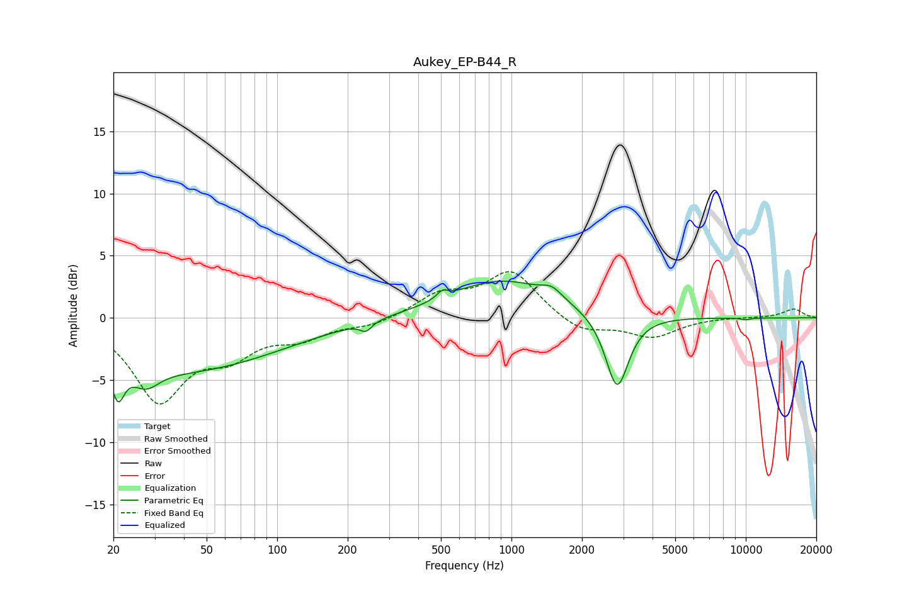

# Aukey_EP-B44_R
See [usage instructions](https://github.com/jaakkopasanen/AutoEq#usage) for more options and info.

### Parametric EQs
Apply preamp of -3.1 dB when using parametric equalizer.

|   # | Type    |   Fc (Hz) |    Q |   Gain (dB) |
|-----|---------|-----------|------|-------------|
|   1 | Peaking |        21 | 5.5  |        -2.7 |
|   2 | Peaking |        28 | 2.59 |        -1.5 |
|   3 | Peaking |        39 | 0.33 |        -4.2 |
|   4 | Peaking |       238 | 6    |         1   |
|   5 | Peaking |       239 | 5.86 |        -1.7 |
|   6 | Peaking |       508 | 6    |         0.6 |
|   7 | Peaking |       911 | 0.63 |         3   |
|   8 | Peaking |      1486 | 3.29 |         0.8 |
|   9 | Peaking |      2824 | 2.87 |        -6.1 |
|  10 | Peaking |     10000 | 6    |        -0.1 |

### Fixed Band EQs
When using fixed band (also called graphic) equalizer, apply preamp of **-3.8 dB** (if available) and set gains manually with these parameters.

|   # | Type    |   Fc (Hz) |    Q |   Gain (dB) |
|-----|---------|-----------|------|-------------|
|   1 | Peaking |        31 | 1.41 |        -6.4 |
|   2 | Peaking |        62 | 1.41 |        -2.4 |
|   3 | Peaking |       125 | 1.41 |        -1.4 |
|   4 | Peaking |       250 | 1.41 |        -0.6 |
|   5 | Peaking |       500 | 1.41 |         1.8 |
|   6 | Peaking |      1000 | 1.41 |         3.7 |
|   7 | Peaking |      2000 | 1.41 |        -1.3 |
|   8 | Peaking |      4000 | 1.41 |        -1.5 |
|   9 | Peaking |      8000 | 1.41 |         0.1 |
|  10 | Peaking |     16000 | 1.41 |         0.7 |

### Graphs

