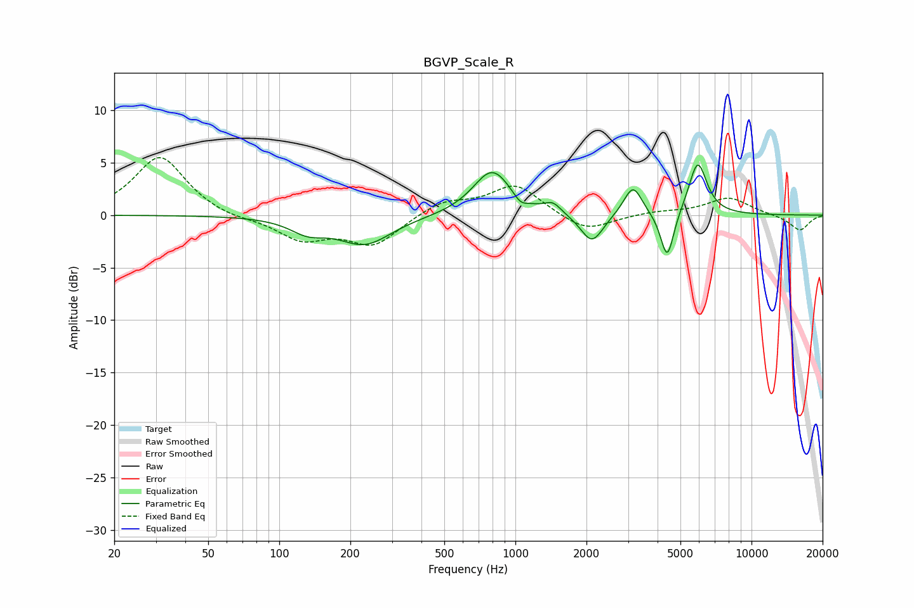

# BGVP_Scale_R
See [usage instructions](https://github.com/jaakkopasanen/AutoEq#usage) for more options and info.

### Parametric EQs
Apply preamp of -4.8 dB when using parametric equalizer.

|   # | Type    |   Fc (Hz) |    Q |   Gain (dB) |
|-----|---------|-----------|------|-------------|
|   1 | Peaking |       132 | 1.9  |        -1.2 |
|   2 | Peaking |       230 | 1.24 |        -2.7 |
|   3 | Peaking |       797 | 1.76 |         4.3 |
|   4 | Peaking |      1049 | 4.79 |        -0.8 |
|   5 | Peaking |      1441 | 4.14 |         0.9 |
|   6 | Peaking |      2109 | 2.93 |        -2.8 |
|   7 | Peaking |      3062 | 2.83 |         0.4 |
|   8 | Peaking |      3154 | 3.81 |         2.5 |
|   9 | Peaking |      4396 | 4.97 |        -4.7 |
|  10 | Peaking |      5919 | 3.6  |         5.1 |

### Fixed Band EQs
When using fixed band (also called graphic) equalizer, apply preamp of **-5.6 dB** (if available) and set gains manually with these parameters.

|   # | Type    |   Fc (Hz) |    Q |   Gain (dB) |
|-----|---------|-----------|------|-------------|
|   1 | Peaking |        31 | 1.41 |         5.6 |
|   2 | Peaking |        62 | 1.41 |        -0.4 |
|   3 | Peaking |       125 | 1.41 |        -2.2 |
|   4 | Peaking |       250 | 1.41 |        -2.8 |
|   5 | Peaking |       500 | 1.41 |         1.3 |
|   6 | Peaking |      1000 | 1.41 |         2.9 |
|   7 | Peaking |      2000 | 1.41 |        -1.7 |
|   8 | Peaking |      4000 | 1.41 |         0.3 |
|   9 | Peaking |      8000 | 1.41 |         1.7 |
|  10 | Peaking |     16000 | 1.41 |        -1.5 |

### Graphs

