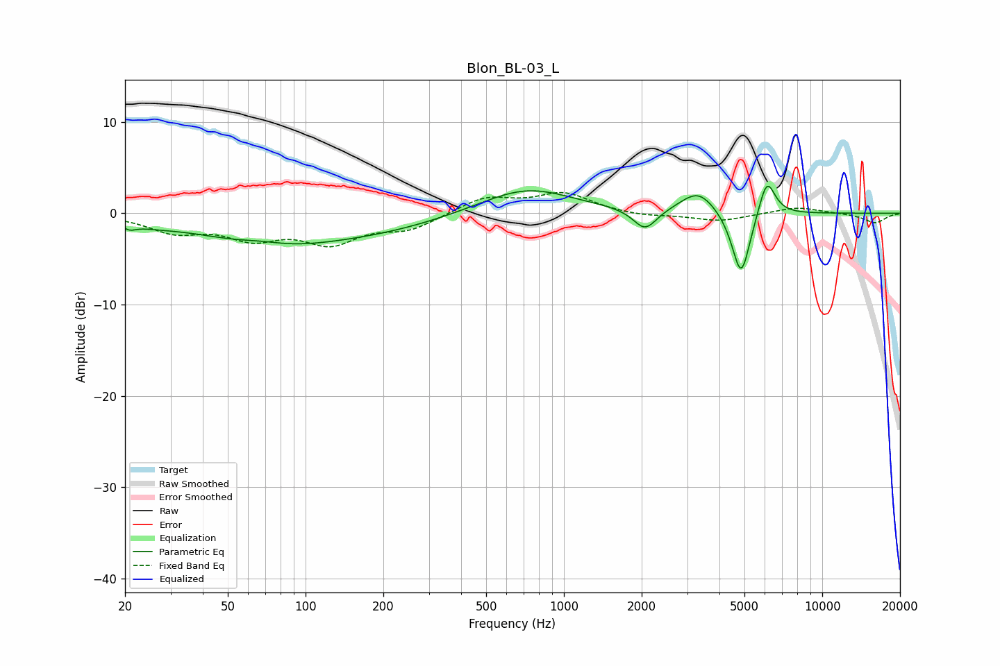

# Blon_BL-03_L
See [usage instructions](https://github.com/jaakkopasanen/AutoEq#usage) for more options and info.

### Parametric EQs
Apply preamp of -3.1 dB when using parametric equalizer.

|   # | Type    |   Fc (Hz) |    Q |   Gain (dB) |
|-----|---------|-----------|------|-------------|
|   1 | Peaking |        21 | 5.87 |        -0.6 |
|   2 | Peaking |        25 | 1.29 |        -0.5 |
|   3 | Peaking |        68 | 1.62 |         0.5 |
|   4 | Peaking |        74 | 0.53 |        -3.1 |
|   5 | Peaking |       205 | 0.55 |        -1.3 |
|   6 | Peaking |       715 | 0.79 |         2.9 |
|   7 | Peaking |      2062 | 3.12 |        -2.4 |
|   8 | Peaking |      3316 | 2.05 |         2.5 |
|   9 | Peaking |      4853 | 3.87 |        -7.5 |
|  10 | Peaking |      6102 | 4.27 |         4.2 |

### Fixed Band EQs
When using fixed band (also called graphic) equalizer, apply preamp of **-2.4 dB** (if available) and set gains manually with these parameters.

|   # | Type    |   Fc (Hz) |    Q |   Gain (dB) |
|-----|---------|-----------|------|-------------|
|   1 | Peaking |        31 | 1.41 |        -1.8 |
|   2 | Peaking |        62 | 1.41 |        -2.4 |
|   3 | Peaking |       125 | 1.41 |        -2.9 |
|   4 | Peaking |       250 | 1.41 |        -1.6 |
|   5 | Peaking |       500 | 1.41 |         1.7 |
|   6 | Peaking |      1000 | 1.41 |         2.1 |
|   7 | Peaking |      2000 | 1.41 |        -0.4 |
|   8 | Peaking |      4000 | 1.41 |        -0.9 |
|   9 | Peaking |      8000 | 1.41 |         0.7 |
|  10 | Peaking |     16000 | 1.41 |        -1.1 |

### Graphs

